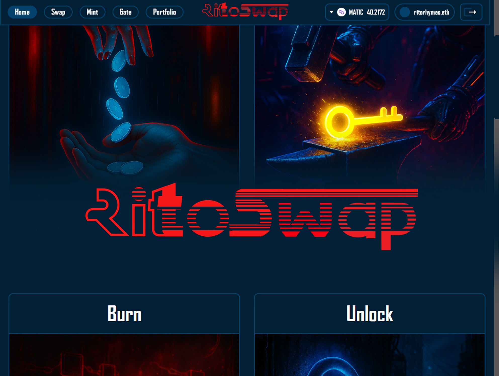

# RitoSwap: Multichain dApp + RapBotRito AI System

**RitoSwap is a two-products-in-one showcase for a modern multichain dApp experience and an AI agentic multi-modal chatbot experience.**

This repository is a demonstration of Rito from RitoVision integrating across product, brand, UX, and full-stack engineering to build what should take at least a small team of specialists to accomplish.

## Live Sites

- Production (Ethereum mainnet): https://ritoswap.com
- Testnet (Sepolia): https://testnet.ritoswap.com
- Docs: https://docs.ritoswap.com
- Storybook UI playground: https://ui.ritoswap.com
- Sepolia faucet: https://cloud.google.com/application/web3/faucet/ethereum/sepolia

## Table of Contents

- [Live Sites](#live-sites)
- [Overview](#overview)
- [Architecture at a Glance](#architecture-at-a-glance)
- [Stack](#stack)
- [Documentation and Playgrounds](#documentation-and-playgrounds)
- [CI/CD and Quality Gates](#cicd-and-quality-gates)
- [Supported Chains](#supported-chains)
- [System Prerequisites](#system-prerequisites)
- [Do Not Use npm](#do-not-use-npm)
- [Mirror Repo](#mirror-repo)
- [No Monetization](#no-monetization)
- [License](#license)

## Overview

RitoSwap merges a Blade Runner-inspired multichain dApp with a branded AI system that is token-gated, tool-aware, and built for a multi-modal experience.

### Product 1: Multichain dApp

- On-chain NFT mint and burn for Colored Keys, plus burn-to-reset identity.
- Token gate with SIWE and JWT access tokens so users can re-enter without re-signing.
- Cross-chain swapping via the LiFi widget.
- Multichain portfolio viewer via Alchemy.
- Custom wallet UI built on Wagmi and WalletConnect with mobile deeplinking.
- Crypto-themed music and PWA functionality across the experience.

### Product 2: AI System - RapBotRito

- Token-gated AI experience embedded inside the token gate.
- Mode-driven behavior (rap battles, freestyle, agent battles) with strict tool allowlists.
- MCP server with JWT-gated tools, LangChain orchestration, and Vercel AI SDK streaming.
- Chat JWT enforcement is configurable via env, while selected tools require JWT when enabled.
- Inline tools for GIFs, images, chain logos, and music playback, with visible tool chips.
- Pinecone semantic database for lore, rhymes, and image search.
- Image generation streams base64 payloads directly to the client (no server-side storage).
- On-chain tools for balances and limited crypto sends (testnet only).
- Quota systems for chat tokens and crypto send limits.
- Provider switching: run offline via LM Studio or use OpenAI, with multiple image providers.

## Architecture at a Glance

The monorepo contains five workspaces plus the root workspace for shared tooling.

1. `/local-blockchain` - Hyperledger Besu QBFT local chain plus Blockscout.
2. `/colored-keys` - ERC-721 contracts, deploy scripts, security testing.
3. `/dapp` - Full-stack Next.js dApp, APIs, AI system, and wallet UX.
4. `/dapp/cloudflare` - Cloudflare Worker plus Durable Object state engine (rate limits, nonces, quotas) and email relay.
5. `/docs` - Nextra docs with embedded Storybook and OpenAPI playgrounds.

## Stack

- Frontend: Next.js, Wagmi, Tanstack Query, Zustand, Framer Motion, Howler, custom wallet UI, custom portfolio UI, LiFi widget, Next-PWA.
- Backend and Infra: Next.js route handlers, PostgreSQL plus Prisma and Prisma Accelerate, Cloudflare R2, Brevo SMTP, Vercel serverless and middleware, Cloudflare Worker and Durable Object state service, SIWE, JWT access tokens.
- AI Backend: Vercel AI SDK, LangChain, MCP server and tool registry, Pinecone semantic database, OpenAI or LM Studio providers, multi-provider image pipeline, JWT-gated tools, token and crypto quotas.
- Blockchain: Hyperledger Besu (local) plus Blockscout, Alchemy and public RPC endpoints, Viem and Ethers.
- Smart contracts: ERC-721, Hardhat, Slither, Mythril, Echidna.
- Testing and QA: Vitest, Playwright (live Sepolia transactions), Supertest live API E2E, Postman, contract tests, Zod-to-OpenAPI spec generation.
- Observability: Sentry (client, server, edge error boundaries and monitoring).

## Documentation and Playgrounds

- Docs site: https://docs.ritoswap.com
- Storybook UI playground: https://ui.ritoswap.com (built from the dapp workspace and embedded in docs pages).
- OpenAPI playgrounds: Swagger UI embedded in docs with a Zod-generated OpenAPI spec.

## CI/CD and Quality Gates

Enterprise-style pipelines ship four public targets (mainnet dapp, testnet dapp, docs, storybook) with staged deploys, smoke tests, and rollback on testnet. Mainnet is gated by the testnet pipeline, which runs linting, unit and integration tests, contract tests, Supertest API suites, and Playwright flows that execute real Sepolia transactions to validate on-chain behavior end to end.

## Supported Chains

- Ethereum
- Sepolia
- Polygon
- Arbitrum
- Avalanche
- Base
- Optimism
- Fantom
- Ritonet (local Besu QBFT)

## System Prerequisites

- Node.js v20.18.1 or higher
- pnpm v10.13.1 or higher
- Docker Engine (latest stable)

## Do Not Use npm

This monorepo has five workspaces and is built, tested, and maintained with pnpm. Using npm will lead to dependency conflicts due to hoisting behavior. Yarn might work, but pnpm is the supported path.

## Mirror Repo

This is a continuously updated mirror snapshot synced with the RitoSwap main repository (privately maintained) for visibility and review purposes. History may be shallow.

## No Monetization

RitoSwap is a production-quality showcase, not a bonafide commercial product for the purpose of directly generating revenue. The platform does not collect nor sell user data, serve ads, charge fees (gas costs are for interacting with the network only, we don't receive **any** portion of that), nor collect any commissions from the swap widget.

## License

The source code is licensed under the MIT License. Trademarks such as Rito Rhymes, RitoVision, and all associated branding, images, logos, and music are privately owned. Use of these brand assets is not granted under this license.
