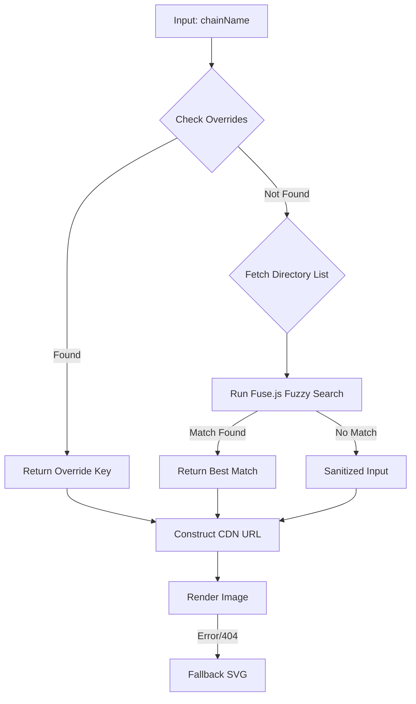

import { Callout } from 'nextra/components'
import { StorybookEmbed } from '@components/StorybookEmbed'

# Chain Logo Renderer

The `<chain-logo>` tag allows RapBotRito (and users) to inject cryptocurrency logos directly into the chat stream. It is designed to support an immersive, on-topic experience—whether the bot is rapping about "Doge" or discussing "Ethereum Classic"—without requiring exact filenames.

## Usage

The parser detects `<chain-logo />` tags and renders the `ChainLogo` component.

```html
<!-- Simple usage -->
<chain-logo chainName="Bitcoin" />

<!-- Custom size (default is 200px if unspecified, usually scaled by CSS) -->
<chain-logo chainName="Ethereum" size="64" />

<!-- Handles typos and aliases -->
<chain-logo chainName="Doge" />
```

## Interactive Demos

Submit a message to see the inline tool generated.

### Chain Logo

<StorybookEmbed title="ChatBot/InlineTools" story="ChainLogoSeeded" height="640px" />

## Architecture & Resolution System

Unlike simple image renderers, `ChainLogo` is backed by a multi-stage resolution system designed to "guess" the right logo even if the input is messy or colloquial.

It relies on the **TrustWallet Assets Repository** as the source of truth for logo images.

### The Resolution Pipeline

When a `<chain-logo chainName="..." />` mounts, it follows this logic path:



### 1. The Override Layer (`ChainOverrides.ts`)
**File:** `dapp/components/chatBot/ChatMessages/renderers/ChainOverrides.ts`

Before doing any network requests or fuzzy searching, the component checks a hardcoded lookup table. This allows us to map colloquial names to the specific directory names required by TrustWallet.

**Why it's needed:**
- **Aliases:** Users say "BSC", but the repo calls it "binance".
- **Shortcuts:** "Doge" maps to "doge" (which might be "dogecoin" in other contexts, but we ensure it hits the right folder).
- **Ambiguity:** "ETC" maps to "classic" (Ethereum Classic).

```typescript
// Example from ChainOverrides.ts
const CHAIN_OVERRIDES = {
  dogecoin: 'doge',
  bsc: 'binance',
  etc: 'classic',
  // ...
};
```

### 2. Fuzzy Search (Fuse.js)
**File:** `dapp/components/chatBot/ChatMessages/renderers/ChainLogo.tsx`

If no override is found, the component consults a cached list of all available blockchains from the TrustWallet repository.

- **Mechanism:** It uses `Fuse.js` to perform a fuzzy search against the directory list.
- **Benefit:** This handles typos ("Bitcion" -> "bitcoin") and partial matches ("Smart Chain" -> "smartchain").
- **Performance:** The directory list is fetched **once** and cached globally in memory. The component uses `useSyncExternalStore` to subscribe to this cache, ensuring that multiple logos on screen don't trigger multiple API calls.

### 3. The Fallback
If the image fails to load (404 from CDN) or the search yields nothing useful, the component renders a generic grey blockchain SVG placeholder. This ensures the layout never breaks due to a missing asset.

## Component API

| Prop | Type | Default | Description |
| :--- | :--- | :--- | :--- |
| `chainName` | `string` | **Required** | The name of the chain to search for (e.g., "Bitcoin", "BSC", "Doge"). |
| `size` | `number` | `200` | The width/height in pixels. The parser also accepts a `width` attribute as an alias for `size`. |

## Implementation Details

### Loading State & Shimmer
Because fetching the directory list and the image itself takes time, the component wraps the image in a `<Shimmer />` loader.
- **Behavior:** The shimmer is visible until the `onLoad` event fires for the specific image URL.
- **UX:** This prevents layout shifts and provides a smooth "fade-in" effect (via `opacity` transition) once the asset is ready.

### Fallback & Placeholder
If the image fails to load (404 from CDN) or the search yields nothing useful, the component renders a **generic grey blockchain SVG placeholder**.

<Callout type="warning">
  **Styling Note:** The fallback SVG is injected as a **Data URI** (`data:image/svg+xml...`). This means you cannot style its internal paths (fill color, stroke) via external CSS. It will always be grey.
</Callout>

### Caching Strategy
To keep the chat snappy, `ChainLogo.tsx` implements a custom external store pattern:
1. **Global Cache:** `BLOCKCHAIN_DIRS_CACHE` holds the array of directory names.
2. **Deduplication:** `ensureFetchStarted()` guarantees only one network request happens even if 50 logos render simultaneously.
3. **Reactivity:** `useSyncExternalStore` updates all components once the fetch completes.

### CDN Construction
Once a key is resolved (e.g., "bitcoin"), the image source is constructed synchronously:

```typescript
const url = `https://cdn.jsdelivr.net/gh/trustwallet/assets@master/blockchains/${key}/info/logo.png`;
```

<Callout type="info">
  **Note on TrustWallet:** We use `jsdelivr` to proxy the GitHub raw content for better performance and caching headers compared to hitting `raw.githubusercontent.com` directly.
</Callout>
