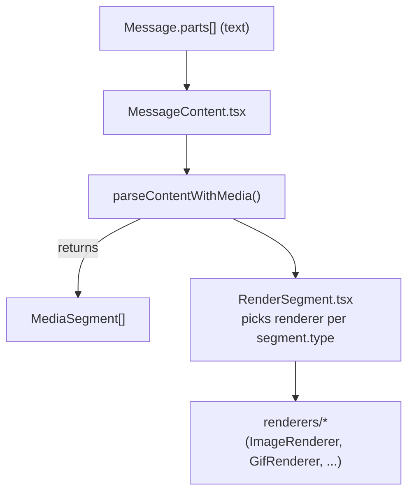

import { Callout, Cards } from 'nextra/components'

# Inline Tool Renderers

Inline tools let RapBotRito stream mixed content (markdown headings, gifs, SVGs, chain logos, music commands, etc.) inside a single assistant message. This page explains the architecture that powers those renderers so you know which file to touch when adding a new tag.

## Scope & Goals

- **Covers** `MessageContent.tsx`, `parseContentWithMedia.ts`, `splitPartsAtAnchor.ts`, `RenderSegment.tsx`, and the renderer helpers inside `dapp/components/chatBot/ChatMessages`.
- **Highlights** the helpers that normalize inline markdown (`mdInline.ts`), sanitize assets (`imageHelpers.ts`, `gifHelpers.ts`, `svgHelpers.ts`), and bridge to the shared `MusicPlayer`.
- **Excludes** ToolActivity chips, prompt stores, or the broader modal layout. Jump to the [Chat Modal transcript section](../chat-modal#transcript-scaffolding-chatmessages--modulecss) for scroll pinning, headers, and composer details.

<Callout type="info">
Inline tools are scoped to assistant turns. `splitPartsAtAnchor.ts` (`dapp/components/chatBot/ChatMessages/utils/splitPartsAtAnchor.ts`) splits only assistant messages around the ToolActivity anchor so chips sit between the "before" and "after" content, while user parts bypass the parser unchanged.
</Callout>

## Transcript Pipeline

The rendering path stacks vertically so it holds up on narrow viewports:



Key stops along the path:

1. **MessageContent (`dapp/.../MessageContent.tsx`)** loops every `MessagePart`, calls `parseContentWithMedia(part.text)`, and streams the resulting `MediaSegment[]` through `<RenderSegment />`.
2. **Split around anchors (`splitPartsAtAnchor.ts`)** ensures tool chips for the current assistant tool are mounted between the parsed segments that came before vs after the anchor index.
3. **RenderSegment.tsx** is the registry that maps each `segment.type` to `LinkRenderer`, `ImageRenderer`, `GifRenderer`, `SvgRenderer`, `ChainLogo`, `MusicCommandRenderer`, or `GoodbyeRenderer`.

## Segment Parsing Rules

`parseContentWithMedia.ts` turns raw strings into typed segments so renderers can stay dumb:

- **Preprocessing**: decodes entities, drops ``` fences, rewrites markdown images to ``, and strips inline backticks around `<svg>//<gif>/<music>/<goodbye>` tags so they survive streaming chunks.
- **Markdown emphasis**: delegates inline bold/italic detection to `mdInline.ts`, producing `formattedText` or `heading` segments with normalized `InlineRun[]` payloads.
- **Link detection**: scans `[label](https://example)` patterns ahead of other tags and emits `{ type: 'link' }` segments before formatted text fallback.
- **Media tags**: matches literal HTML-like tokens for ``, `<svg>`, `<gif>`, `<chain-logo>`, `<key-nft>`, `<music>`, and `<goodbye/>`. Helpers extract safe attributes:
  - `imageHelpers.ts` reads `src`, `alt`, `width`, `height` for `` strings.
  - `gifHelpers.ts` resolves local gifs to `/gifs/...` paths and normalizes dimensions.
  - `svgHelpers.ts` adds namespaces, viewBox defaults, and `preserveAspectRatio` before sanitization.
- **Chain logos**: `<chain-logo chainName="Base" size="160" />` is parsed into `{ type: 'chainLogo', chainName, size }` so `ChainLogo.tsx` can resolve the right TrustWallet asset, complete with overrides and Fuse fuzzy matching.
- **Music cues**: `<music song="demo" timeline="1:14" action="play" />` map to `MusicSegment` with `song`, `ext`, `timeline`, `autoplay`, and `action` props for the renderer.
- **Goodbye timer**: `<goodbye width="360" seconds="8" />` becomes a dedicated `GoodbyeSegment`, arming the countdown component that reloads the page via sessionStorage-backed timers.

## Renderer Registry

`RenderSegment.tsx` performs a strict type switch so the actual renderers never have to parse raw strings:

- `formattedText`/`heading` map to inline React trees using `InlineRuns`. Everything else requires a renderer from `dapp/components/chatBot/ChatMessages/renderers`.
- `ImageRenderer.tsx` handles shimmer loading, `store://` hydration via `@store/toolImageStore`, and `` fallbacks.
- `GifRenderer.tsx` simply forwards to `ImageRenderer` with a default width, so `<gif>` tags share the same shimmer/error handling.
- `SvgRenderer.tsx` wraps DOMPurify sanitization around the helper-massaged SVG string (including the inline SVG built for `<key-nft>` tokens).
- `ChainLogo.tsx` lazily fetches the TrustWallet repo directory listing, runs Fuse to pick a logo path, and falls back to an inline SVG placeholder.
- `MusicCommandRenderer.tsx` issues imperative commands to the shared `useMusic` hook (load song, seek, play/pause), scrolls to `#music-bar`, and renders a pill summarizing the action.
- `GoodbyeRenderer.tsx` schedules a hard `window.location.reload()` relative to `sessionStorage` so the timer survives unmounts.

Because the registry is the single point of truth, adding a new tag means:

1. Teach `parseContentWithMedia.ts` how to read attributes and emit a new `MediaSegment` variant.
2. Extend `RenderSegment.tsx` to map that variant to a new renderer component.
3. Export the renderer via `renderers/index.ts` so other tests/utilities can reference it.

## Voice Clone Hook (Speakable Text)

The TTS voice clone does not use an inline tag. Instead, the assistant bubble renders `AssistantAudioButton.tsx`, which calls `extractSpeakableText.ts` to strip inline tools and formatting before sending text to `/api/tts`. This keeps the audio clean even when the transcript includes `<music />`, `<gif />`, or other inline tool tags.

## Example: Plain Links

Link rendering is intentionally boring yet illustrative. When `parseContentWithMedia` hits `[docs](https://example.com)`, it emits `{ type: 'link' }`. `RenderSegment` passes that to `LinkRenderer.tsx`, which:

- Rejects any non-`http(s)` href by falling back to `#`.
- Colors the `<a>` element differently for user vs assistant roles.
- Forces `target="_blank"` + `rel="noopener noreferrer"` for safety.

If you are contributing a new renderer, mimic this pattern: keep input props typed, gate external URLs, and avoid side effects in the render path.

## Inline Tool Catalog

| Tag(s) | Renderer | Helper(s) | Doc |
| --- | --- | --- | --- |
| `[label](url)` | `LinkRenderer.tsx` | built-in regex guard | — (covered above) |
| `` | `ImageRenderer.tsx` | `imageHelpers.ts` | [Images, SVGs & KeyNFT](/ai-systems/chat-ui/inline-tools/images) |
| raw `<svg ...>` / `<key-nft .../>` | `SvgRenderer.tsx` (the parser converts `<key-nft>` to SVG markup) | `svgHelpers.ts`, `prepareSvg()` | [Images, SVGs & KeyNFT](/ai-systems/chat-ui/inline-tools/images) |
| `<gif .../>` | `GifRenderer.tsx` (wraps `ImageRenderer`) | `gifHelpers.ts` | [GIFs](/ai-systems/chat-ui/inline-tools/gifs) |
| `<chain-logo .../>` | `ChainLogo.tsx` | `ChainOverrides.ts`, Fuse search, TrustWallet directory cache | [Chain Logo](/ai-systems/chat-ui/inline-tools/chain-logo) |
| `<music .../>` | `MusicCommandRenderer.tsx` | `MusicPlayer/MusicProvider.tsx` | [Music Bar & Commands](/ai-systems/chat-ui/inline-tools/music-bar) |
| `<goodbye .../>` | `GoodbyeRenderer.tsx` | sessionStorage deadline helpers | [Goodbye Timer](/ai-systems/chat-ui/inline-tools/goodbye) |

Use this table as the hub: each doc dives into prop examples, styling, and troubleshooting for that renderer.

## Music Commands & Player Bridge

`MusicCommandRenderer.tsx` lives with the other chat renderers but talks to the shared `MusicPlayer` located at `dapp/components/chatBot/MusicPlayer`. When a `<music>` segment arrives:

- The renderer calls `useMusic()` and executes commands exactly once via `useEffect`, respecting `song`, `ext`, `timeline`, and `action` values.
- Clicking or pressing `Enter`/`Space` on the pill scrolls to the persistent `<MusicBar />` so users can see what changed.
- Loading a song plus seeking is a two-step operation (load without autoplay → seek with autoplay), mirroring the code path in the component.

Any future inline audio tool should reuse this bridge rather than touching the player directly.

## Helper Responsibilities & Extension Points

- **`mdInline.ts`**: supports headings + emphasis for agent-authored markdown. If you need more inline tokens (e.g., code spans), extend this file so every renderer benefits.
- **`imageHelpers.ts` / `gifHelpers.ts`**: single source for parsing attribute strings. Update them when you add new attributes so renderers stay stateless.
- **`svgHelpers.ts`**: guardrails that add `xmlns`, `viewBox`, and dimension defaults for inline `<svg>` strings (including the generated `<key-nft>` markup) before DOMPurify runs.
- **`renderers/__tests__`**: houses renderer-level tests. Add snapshots/behavior tests here whenever you ship a new renderer or adjust parsing logic.

## Testing & Safety Checklist

- **Parser coverage**: when introducing a new tag, add unit tests for `parseContentWithMedia` so streaming edge cases (e.g., fenced code removal, entity decoding) don’t regress.
- **Renderer tests**: use the `renderers/__tests__` sandbox to verify color, aria-labels, and behavior (music pills, countdown timers) without spinning up the whole modal.
- **Sanitization**: never render untrusted markup without going through `prepareSvg` + DOMPurify or a similar sanitizer.
- **Streaming awareness**: keep renderers pure. If you need side effects (`MusicCommandRenderer`, `GoodbyeRenderer`), gate them inside `useEffect` to avoid duplicate fires when React re-renders mid-stream.

## Related Docs & Deep Dives

<Cards num={3}>
  <Cards.Card title="Chat Modal Transcript" href="/ai-systems/chat-ui/chat-modal#transcript-scaffolding-chatmessages--modulecss" icon="🧱" arrow>
    Layout, scroll pinning, and anchors that surround these renderers.
  </Cards.Card>
  <Cards.Card title="Inline Tool Specs" href="/ai-systems/chat-ui/inline-tools/images" icon="🧩" arrow>
    Start with the images/SVG/KeyNFT doc, then branch to GIFs, chain logos, goodbye, and music.
  </Cards.Card>
  <Cards.Card title="Music Player" href="/ai-systems/chat-ui/inline-tools/music-bar" icon="🎧" arrow>
    Explains the persistent MusicBar UI that `<music>` commands control.
  </Cards.Card>
  <Cards.Card title="System Prompts" href="/ai-systems/context-management/system-prompts" icon="🧠" arrow>
    How Prompt Fragments teach the LLM to use these inline tags.
  </Cards.Card>
</Cards>
