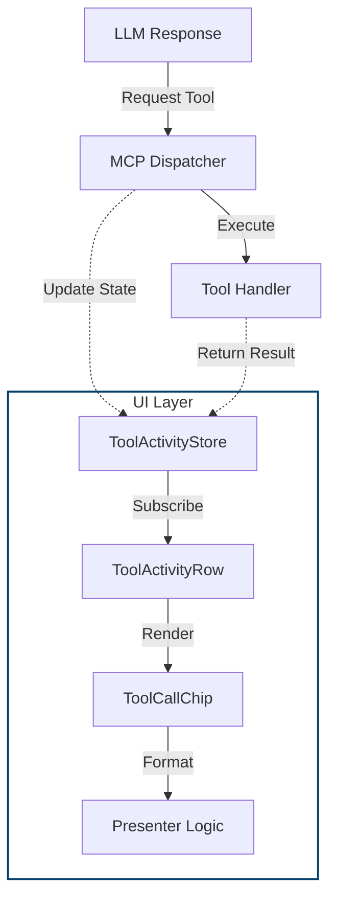

import { Cards } from 'nextra/components'

# Tool Chips & Activity UI

The Tool Activity system provides real-time visibility into the agent's actions. Instead of opaque loading states or raw JSON logs, the UI renders "Tool Chips" that describe *what* the agent is doing (e.g., "Generating image...", "Checking balance") and the outcome of those actions.

## Overview

This system bridges the gap between the LLM's functional requests (MCP Tool Calls) and the user interface. It transforms technical execution steps into human-readable status updates.

### Key Components

| Component | Description |
| :--- | :--- |
| `ToolCallChip` | The atomic UI element representing a single tool execution. Displays status (spinner/check/cross) and a formatted label. |
| `ToolActivityRow` | A container that groups all tool calls triggered by a single chat message. It appears immediately below the message bubble. |
| `ToolActivityStore` | A Zustand store that tracks the state of every tool call, linking them to specific UI message IDs. |

---

## Data Flow & Architecture

The system follows a unidirectional flow from the LLM's decision to the final UI update.



1.  **Trigger**: The LLM decides to call a tool (e.g., `generate_image`).
2.  **Execution**: The `MCPDispatcher` receives the request and executes the corresponding handler.
3.  **State Update**: As the tool runs (pending) and completes (success/error), the `ToolActivityStore` is updated with the result.
4.  **Rendering**: The `ToolActivityRow` observes these changes and renders a `ToolCallChip`.
5.  **Formatting**: The chip uses a **Presenter** to convert the raw data into a user-friendly string.

---

## The Presenter Pattern

`dapp/components/chatBot/ToolActivity/catalog/`

The core logic for *how* a tool looks lies in the "Presenter" pattern. This separates the React rendering logic from the specific formatting needs of each tool.

### Interface
Every tool has a presenter that implements the `ToolChipPresenter` interface:

```typescript
export interface ToolChipPresenter {
  toolName: string;
  pending: (chip: ChipLike) => ToolChipContent;
  success: (chip: ChipLike) => ToolChipContent;
  error: (chip: ChipLike) => ToolChipContent;
}
```

### Example: Image Generation
For the `generate_image_with_alt` tool, the presenter transforms the raw JSON output into a clean label.

*   **Pending**: "Generating image..."
*   **Success**: Parses the output to find the image dimensions and name, returning "Image ready: sunset.png (1024x1024)".
*   **Error**: "Image generation failed".

### The Catalog
The system uses a registry (`catalog/index.ts`) to map tool names to their presenters. If no specific presenter exists for a tool, it falls back to a `defaultPresenter` that simply shows the tool name and status.

<Cards num={1}>
  <Cards.Card
    title="Server-Side Tool Context"
    href="/ai-systems/context-management/tool-context"
    arrow
  >
    Learn how tools are whitelisted and how the dual-stream architecture separates JSON data from the LLM's text summary.
  </Cards.Card>
</Cards>

## Playground Demo

Use the Storybook controls to preview tool-chip states.

<div style={{ width: '100%', height: 820, margin: '2rem 0' }}>
  <iframe
    src="/storybook-static/index.html?path=/story/chatbot-toolchips-isolated--playground&nav=0&panel=controls&addons=1"
    width="100%"
    height="100%"
    style={{ border: '1px solid rgba(255,255,255,0.1)', borderRadius: '10px' }}
    title="ChatBot/ToolChips/Isolated - Playground"
    loading="lazy"
    tabIndex={-1}
  />
</div>
