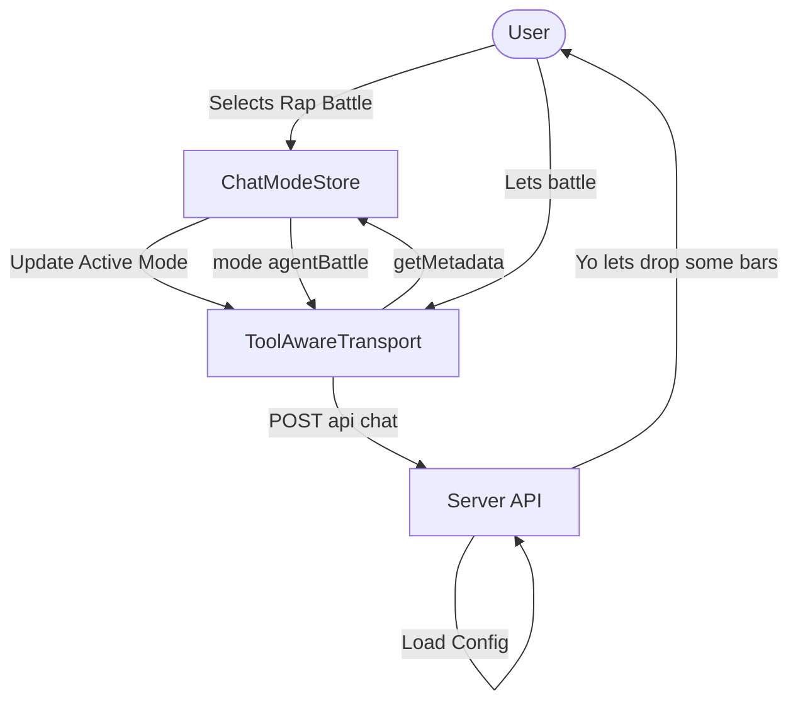

import { Cards, Table } from 'nextra/components'


# Client Context (User State)

While the server defines *who the agent is*, the client defines *who the user is*. This "User Context" is dynamic, changing as the user connects their wallet, buys NFTs, or switches modes.

## The Injection Mechanism: `ToolAwareTransport`

The bridge between the React state and the AI system is the `ToolAwareTransport`. This custom transport layer wraps the standard Vercel AI SDK transport to intercept requests and inject metadata.

Located in `dapp/app/lib/llm/client/ToolAwareTransport.ts`, it performs two critical functions:

1.  **Metadata Injection**: It reads the current state (Mode, Auth) and merges it into the request body.
2.  **Stream Teeing**: It splits the incoming SSE stream to parse tool events for the UI (see [Streaming Context](./streaming-context)).

```typescript
// Simplified logic from ToolAwareTransport.ts
const toolAwareFetch = async (input, init) => {
  if (isPostToChatApi) {
    const metadata = getMetadata(); // Reads fresh state
    const body = JSON.parse(init.body);
    
    // Inject metadata
    init.body = JSON.stringify({
      ...body,
      metadata: { ...body.metadata, ...metadata }
    });
  }
  return fetch(input, init);
};
```

## Gathering User State

The `ChatBot` component (`dapp/components/chatBot/index.tsx`) is responsible for aggregating the user's "World State" into a cohesive object called `nftContext`.

### Components of User Context

| Field | Source | Description |
|-------|--------|-------------|
| **Wallet Address** | `wagmi.useAccount()` | The user's public 0x address. |
| **Chain ID** | `wagmi.useChainId()` | The network the user is currently connected to. |
| **ENS Name** | `wagmi.useEnsName()` | The user's resolved Ethereum Name (e.g., `rito.eth`). |
| **Key NFT** | `useNFTStore()` | Whether the user owns the Key NFT, and its visual properties (colors). |
| **Active Mode** | `useChatModeStore()` | The currently selected chat mode (e.g., "Rap Battle"). |

### Visual Representation

The context is not just hidden metadata; it is visually represented to the user to reinforce trust.

*   **User Header**: `UserHeaderWithWagmi.tsx` displays the user's ENS avatar and name. If the LLM addresses the user as "rito.eth", the user sees that name in their chat bubble, confirming the context is shared.
*   **WagmiBoundary**: A safety wrapper that ensures if the wallet connection fails or flickers, the chat UI degrades gracefully to a "Guest" state rather than crashing.

### Context Ingestion Sources

<Table>
  <thead>
    <tr>
      <th>Source</th>
      <th>Injected Where?</th>
      <th>Details</th>
    </tr>
  </thead>
  <tbody>
    <tr>
      <td>NFT state + wallet info</td>
      <td><code>composeSystemPrompt</code> &amp; metadata sent via <code>ToolAwareTransport</code></td>
      <td>`ChatBot` builds <code>NFT_CONTEXT_JSON</code> with wallet status, ENS, chain IDs, and colored-key palette so every mode sees the same profile.</td>
    </tr>
    <tr>
      <td>Battle background form</td>
      <td><code>composeWelcomeMessage</code></td>
      <td>The battle form generates a markdown “Background” section with user + RapBotRito traits, giving the model immediate fodder.</td>
    </tr>
    <tr>
      <td>Pinecone matches</td>
      <td>MCP tool outputs</td>
      <td>Semantic search results include concise text plus JSON arrays, letting the LLM weave references while the UI renders gifs or image previews.</td>
    </tr>
    <tr>
      <td>Agent resource packs</td>
      <td><code>agent-rap-verse</code> orchestrator</td>
      <td>The agent’s gathering phase decides whether to pull memes, Rito pics, rhyme samples, wallet balances, or generate fresh images before composing.</td>
    </tr>
  </tbody>
</Table>

## Mode Selection

## Mode Selection

The **Active Mode** is a special piece of context that drives the entire experience.

1.  **Selection**: The user selects a mode via `ModeSelectModal`.
2.  **Store Update**: `useChatModeStore` updates the global `activeMode`.
3.  **Prompt Composition**: The client immediately generates the mode-specific System Prompt and adds it to the chat history.
4.  **Transport Injection**: The `ToolAwareTransport` injects the mode metadata.
5.  **Server Enforcement**: The server reads the mode metadata to enforce the [Tool Whitelist](./tool-context).



## Related Docs

<Cards num={2}>
  <Cards.Card
    title="Mode Selection UI"
    href="/ai-systems/chat-ui/sub-modals"
    arrow
  >
    Documentation for the `ModeSelectModal` and `BattleFormModal` components.
  </Cards.Card>
  <Cards.Card
    title="Chat Header UI"
    href="/ai-systems/chat-ui/chat-modal"
    arrow
  >
    Details on the `ChatHeader` and `UserHeaderWithWagmi` components.
  </Cards.Card>
</Cards>
