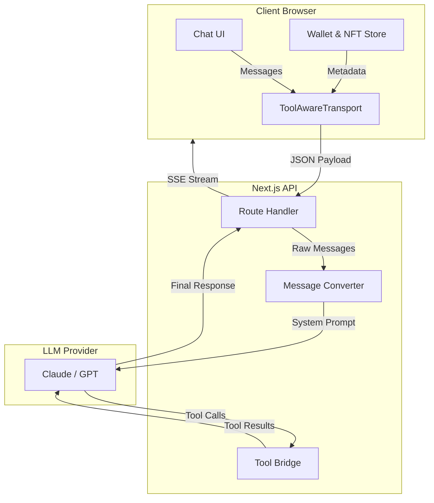

# Context Management

The RitoSwap AI system employs a multi-layered approach to context management, ensuring that the LLM is always aware of the user's blockchain state, the active application mode, and the specific tools available for the task.

This section details how context is gathered on the client, transmitted securely to the server, and composed into a rich system prompt that guides the agent's behavior.

import { Cards } from 'nextra/components'

<Cards>
  <Cards.Card title="System Prompts" href="/ai-systems/context-management/system-prompts" arrow />
  <Cards.Card title="Client Context" href="/ai-systems/context-management/client-context" arrow />
  <Cards.Card title="Tool Context" href="/ai-systems/context-management/tool-context" arrow />
  <Cards.Card title="Streaming Context" href="/ai-systems/context-management/streaming-context" arrow />
</Cards>

## High-Level Pipeline

The following diagram illustrates how context flows from the user's browser through our custom transport layer and into the LLM.

## Types of Context

We categorize context into three distinct layers, each managed by different parts of the application:

### 1. System Context (Server-Side)
This is the "immutable" identity of the agent. It includes:
- **Base Identity**: "You are a helpful AI assistant powered by..."
- **Mode Instructions**: Specific rules for the current activity (e.g., "Rap Battle Mode", "Freestyle Mode").
- **Safety Guardrails**: Core rules that cannot be overridden by user prompts.
- **Prompt Fragments**: Reusable blocks of text that teach the LLM how to use inline tools like `<chain-logo />` or `<gif />`.
- **Speech Guidance**: Rap style fragments include punctuation rules so the voice clone can pause naturally between bars.

### 2. User Context (Client-Side)
This represents the dynamic "world state" of the user. It is gathered in the browser and injected into every request:
- **Wallet State**: Connected address, chain ID, and network name.
- **Identity**: ENS name and avatar.
- **NFT Ownership**: Whether the user holds the Key NFT, and its specific visual properties (colors, background).
- **Session History**: The conversation log up to this point.

### 3. Tool Context (Functional)
This defines what the agent *can do* at any given moment:
- **MCP Whitelisting**: The server filters available tools based on the active mode (e.g., `send_crypto_to_signed_in_user` only appears after Round 3 in Rap Battle modes).
- **Tool Results**: The output of tool executions (JSON or text) is fed back into the context window, allowing the agent to react to real-world data.

### 4. Token Quotas (Operational Context)
While not strictly "context" that shapes the agent's personality, **Token Quotas** are a critical operational constraint that affects the *availability* of the context window.

<Cards>
  <Cards.Card title="Deep Dive: Quotas & Limits" href="/ai-systems/operations/quotas" arrow />
</Cards>

- **Distinction**: Quotas do **not** alter the system prompt or the agent's instructions. They are a hard limit on the *volume* of context processed.
- **Relationship**: A larger context window (more history, more tool results) consumes the user's token budget faster.
- **Mechanism**: If the quota is exceeded, the request is rejected *before* the LLM sees the context. This ensures that the "Context Management" pipeline never runs for unauthorized or over-budget requests.

## Key Components

| Component | Location | Responsibility |
|-----------|----------|----------------|
| **ToolAwareTransport** | `lib/llm/client` | Intercepts requests to inject client-side metadata (Mode, Auth). |
| **Handler** | `lib/llm/handler.ts` | Orchestrates the request, builds the system prompt, and manages the SSE stream. |
| **Message Converter** | `lib/llm/message-converter.ts` | Transforms UI messages into LangChain-compatible formats and appends NFT context. |
| **Mode Configs** | `lib/llm/modes` | Defines the specific system prompts and available tools for each mode. |
