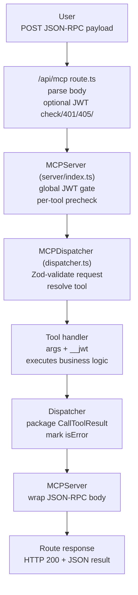

import { Callout, Table } from 'nextra/components'

# MCP Server

The **Model Context Protocol (MCP) server** glues the chat runtime to every tool in `dapp/app/lib/mcp`. This page zooms into the HTTP entry point, authentication layers, dispatcher, and the helper clients that proxy JSON-RPC calls back into the chat UI.

## Component Map

<Table>
  <thead>
    <tr>
      <th>Layer</th>
      <th>File</th>
      <th>Key Dependencies</th>
    </tr>
  </thead>
  <tbody>
    <tr>
      <td>Next.js route</td>
      <td><code>dapp/app/api/mcp/route.ts</code></td>
      <td><code>aiServerConfig</code>, <code>readJwtFromAny</code>, <code>verifyAccessToken</code></td>
    </tr>
    <tr>
      <td>MCP server shell</td>
      <td><code>dapp/app/lib/mcp/server/index.ts</code></td>
      <td><code>verifyMCPAuth</code>, <code>toolRegistry</code>, <code>aiPublicConfig</code></td>
    </tr>
    <tr>
      <td>Dispatcher</td>
      <td><code>dapp/app/lib/mcp/server/dispatcher.ts</code></td>
      <td><code>@schemas/dto/mcp</code> (Zod), <code>verifyMCPAuth</code>, tool handlers</td>
    </tr>
    <tr>
      <td>Auth helpers</td>
      <td><code>dapp/app/lib/mcp/server/auth.ts</code></td>
      <td><code>@lib/jwt/server</code>, Next.js <code>cookies()</code></td>
    </tr>
    <tr>
      <td>Tool registry</td>
      <td><code>dapp/app/lib/mcp/tools/index.ts</code></td>
      <td><code>aiServerConfig</code>, <code>pineconeConfig</code></td>
    </tr>
    <tr>
      <td>Chat bridge</td>
      <td><code>dapp/app/lib/llm/tool-bridge.ts</code></td>
      <td><code>toolRegistry</code>, mode configs, JSON-RPC client</td>
    </tr>
    <tr>
      <td>External client</td>
      <td><code>dapp/app/lib/mcp/client.ts</code></td>
      <td><code>CallToolResultSchema</code>, <code>ListToolsResultSchema</code>, <code>ai.tool</code></td>
    </tr>
  </tbody>
</Table>

## Request Lifecycle



<Callout type="info">
  JSON-RPC compatibility matters: both `callMcpTool` and `MCPClient` send `{ method: 'tools/call', params: { name, arguments } }` payloads and expect a `CallToolResult` object (`content[]`, optional `isError`).
</Callout>

### 1. Route policy (`dapp/app/api/mcp/route.ts`)

- Parses the body up front so `readJwtFromAny` can inspect headers, payload fields, or cookies for bearer tokens.
- If `aiServerConfig.requiresJwt` is true, the route verifies the token with `verifyAccessToken` before handing the request to `mcpServer.handleRequest`.
- Logs method metadata and standardizes parse errors (`code: -32700`).

```ts
export async function POST(req: Request): Promise<Response> {
  const body = await req.json().catch(() => {
    throw new Error('Invalid JSON body');
  });

  if (aiServerConfig.requiresJwt) {
    const bearer = readJwtFromAny(req, body);
    if (!bearer) {
      return new Response(JSON.stringify({ error: 'Unauthorized: missing JWT' }), {
        status: 401,
        headers: { 'Content-Type': 'application/json' },
      });
    }
    try {
      await verifyAccessToken(bearer);
    } catch {
      return new Response(JSON.stringify({ error: 'Unauthorized: invalid JWT' }), {
        status: 401,
        headers: { 'Content-Type': 'application/json' },
      });
    }
  }

  return mcpServer.handleRequest(req, body);
}
```

- Sets `export const runtime = 'nodejs'` to force the route onto the Node runtime (streaming SSE consumers rely on it).
- `GET` requests respond with `405` and an inline explanation so probes know the endpoint is JSON-RPC-only.

### 2. Server shell (`dapp/app/lib/mcp/server/index.ts`)

- Initializes with the same `requiresJwt` flag exposed publicly (`aiPublicConfig`) so the UI can reflect whether auth is required.
- Runs a second `verifyMCPAuth` pass. When the incoming payload is `tools/call`, it looks up the tool in `toolRegistry` and forces verification again if the tool specifies `requiresJwt` (even when the global flag is off).
- Returns JSON-RPC style errors (`code: -32001` / `-32603`) and ensures HTTP status codes mirror auth vs server failures.

### 3. Dispatcher (`dapp/app/lib/mcp/server/dispatcher.ts`)

- Validates every request against `MCPRequestSchema` from `@schemas/dto/mcp`, catching malformed JSON-RPC calls before any tool logic runs.
- `tools/list` simply streams the already-registered tool metadata back.
- `tools/call` locates the tool definition, runs another `verifyMCPAuth` when `requiresJwt` is true, and injects the verified claims into `args.__jwt` so handlers can rely on `address`, `sub`, and `tokenId` without re-parsing the token.
- All handlers are expected to return `{ content: [{ type, text|data }], isError?: boolean }`. Errors bubble through as in-band content so SSE chips and the LLM receive the same failure reason.

### 4. Authentication helper (`dapp/app/lib/mcp/server/auth.ts`)

- Prioritizes the `Authorization` header, but also inspects `body.jwt`, `body.data.jwt`, and finally the Next.js `cookies()` store for `access_token` / `jwt` cookies.
- Uses `verifyAccessToken` from `@lib/jwt/server` and normalizes the claims so downstream code always sees `sub`, `address`, and `addr` fields (strings only).
- Returns the token ID when the verifier surfaces it so tool handlers can correlate mutations or quota entries.

### 5. Tool runtime (`dapp/app/lib/mcp/tools/*`)

- `toolRegistry` only registers a tool when its dependencies are configured (e.g., send-crypto requires `AI_PRIVATE_KEY`, Pinecone tools require `pineconeConfig.isConfigured`). This keeps the server from advertising tools that would fail at runtime.
- Each tool exports `requiresJwt` and an `inputSchema`. The schema is used for OpenAI manifests (`getOpenAIToolSchemas`) while the `requiresJwt` flag stays server-side.
- `tool-errors.ts` defines the `fail()` helper so handlers can abort early and surface canonical red chips without throwing raw strings.

### 6. Chat bridge (`dapp/app/lib/llm/tool-bridge.ts`)

- `getOpenAIToolSchemas(mode)` filters the registry by each mode’s `mcpTools` whitelist (`dapp/app/lib/llm/modes/configs/*.ts`), ensuring rap battles and freestyle chats receive different manifests.
- `callMcpTool` constructs a JSON-RPC payload, forwards the user’s bearer token (or an override), and parses the JSON response, surfacing HTTP, JSON, and RPC errors separately for easier logging.
- `formatToolResult` chooses the most human-friendly text portion from a tool’s result before handing it back to the LLM, while SSE consumers display the structured JSON.

### 7. External MCP client (`dapp/app/lib/mcp/client.ts`)

- `MCPClient` is a lightweight fetch wrapper that shares the same JSON-RPC contract, Zod-validated responses (`CallToolResultSchema`, `ListToolsResultSchema`), and timeout handling.
- `createMCPTools` uses the `ai` package’s `tool()` helper to register schema-less proxies against OpenAI / Anthropic runtimes without tripping invalid parameter errors. It reuses `MCPClient` to execute actual calls.

## Extending the Server

1. **Add the tool** — export a definition in `dapp/app/lib/mcp/tools/<your-tool>.ts`, set `requiresJwt` only if you truly need JWT claims, and register it in `toolRegistry`.
2. **Expose the schema** — if the tool should be available to the LLM, whitelist it inside the relevant mode config’s `mcpTools` array.
3. **Document the behavior** — create a companion `.mdx` page (like the other tool docs) and link to it from the catalog table.
4. **Optional auth tweaks** — if the tool needs non-standard claims, extend `verifyMCPAuth` or provide a handler-specific validator; all `__jwt` data is injected under `args.__jwt`.

<Callout>
  Remember that both the UI presenters and the LLM runtime lean on the `content` array. Always include at least one text entry for the model and reserve JSON blobs for chips / telemetry.
</Callout>
