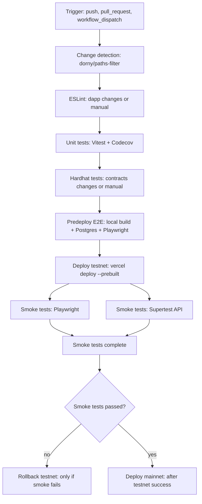

import { Callout, Table } from 'nextra/components'

# DApp Pipeline

The DApp pipeline runs on changes to the dapp or contracts workspaces and ships the mainnet and testnet deployments. It includes unit tests, smart contract tests, predeploy E2E validation, testnet smoke tests, rollback, and then mainnet deploy.

## Triggers and change detection

<Table>
  <thead>
    <tr>
      <th>Trigger</th>
      <th>Details</th>
    </tr>
  </thead>
  <tbody>
    <tr>
      <td>push / pull_request</td>
      <td>Runs on <code>main</code> for changes in <code>dapp/&#42;&#42;</code>, <code>colored-keys/&#42;&#42;</code>, or workflow/action files</td>
    </tr>
    <tr>
      <td>workflow_dispatch</td>
      <td>Manual run from GitHub Actions UI</td>
    </tr>
    <tr>
      <td>paths-filter</td>
      <td>Sets <code>dapp</code> and <code>contracts</code> flags for conditional jobs</td>
    </tr>
  </tbody>
</Table>

<Callout type="warning">
  Workflow or action file changes trigger the workflow, but all jobs will skip because the
  paths filter only checks <code>dapp/&#42;&#42;</code> and <code>colored-keys/&#42;&#42;</code>. Use
  <code>workflow_dispatch</code> when testing CI changes.
</Callout>

## Job flow

<ol>
  <li><strong>Change detection</strong>: <code>dorny/paths-filter</code> marks whether dapp or contracts changed.</li>
  <li><strong>ESLint</strong>: runs only when dapp changes or manual dispatch.</li>
  <li><strong>Unit tests</strong>: Vitest with Codecov upload via OIDC.</li>
  <li><strong>Hardhat tests</strong>: runs when contracts change or manual dispatch.</li>
  <li><strong>Predeploy E2E</strong>: local build with Postgres service and Playwright smoke tests.</li>
  <li><strong>Deploy testnet</strong>: prebuilt Vercel deploy (local build + <code>vercel deploy --prebuilt</code>).</li>
  <li><strong>Smoke tests</strong>: Playwright E2E and Supertest API tests run in parallel against testnet.</li>
  <li><strong>Rollback testnet</strong>: rolls back to previous production URL if smoke tests fail.</li>
  <li><strong>Deploy mainnet</strong>: prebuilt Vercel deploy after testnet smoke tests pass.</li>
</ol>

## Workflow Diagram

  

  

## Deploy mode

- Testnet and mainnet use <code>mode: prebuilt</code> in the <code>vercel-deploy</code> action.
- Builds run from repo root; Vercel Root Directory must point at <code>dapp</code> for the DApp projects.

## Coverage behavior

- DApp unit tests upload coverage to Codecov when running in this pipeline.
- Coverage reports are also uploaded as GitHub artifacts for every unit-test run.

## Rollback behavior

<Callout type="info">
  Rollback is only enabled on testnet. Smoke tests on testnet are treated as a close approximation
  of mainnet behavior, and mainnet skips smoke tests because it targets live chains. The rollback
  flow can be added to mainnet if desired.
</Callout>

## Required secrets and vars

<Table>
  <thead>
    <tr>
      <th>Name</th>
      <th>Type</th>
      <th>Used for</th>
    </tr>
  </thead>
  <tbody>
    <tr>
      <td>VERCEL_TOKEN</td>
      <td>Secret</td>
      <td>All Vercel deploys</td>
    </tr>
    <tr>
      <td>VERCEL_ORG_ID</td>
      <td>Secret</td>
      <td>All Vercel deploys</td>
    </tr>
    <tr>
      <td>VERCEL_PROJECT_ID</td>
      <td>Secret</td>
      <td>All Vercel deploys</td>
    </tr>
    <tr>
      <td>PRIVATE_KEY_PLAYWRIGHT</td>
      <td>Secret</td>
      <td>Playwright smoke tests</td>
    </tr>
    <tr>
      <td>PRIVATE_KEY_API</td>
      <td>Secret</td>
      <td>Supertest API smoke tests</td>
    </tr>
    <tr>
      <td>TOKEN_ID</td>
      <td>Secret</td>
      <td>Supertest API smoke tests</td>
    </tr>
    <tr>
      <td>TEST_BASE_URL</td>
      <td>Var</td>
      <td>Base URL for smoke tests (currently testnet)</td>
    </tr>
    <tr>
      <td>CHAIN_ID</td>
      <td>Var</td>
      <td>Supertest chain ID</td>
    </tr>
    <tr>
      <td>NEXT_PUBLIC_ENABLE_STATE_WORKER</td>
      <td>Var</td>
      <td>Supertest toggle for state worker</td>
    </tr>
    <tr>
      <td>NEXT_PUBLIC_AI_CHAT_REQUIRES_JWT</td>
      <td>Var</td>
      <td>Supertest toggle for JWT requirements</td>
    </tr>
  </tbody>
</Table>
