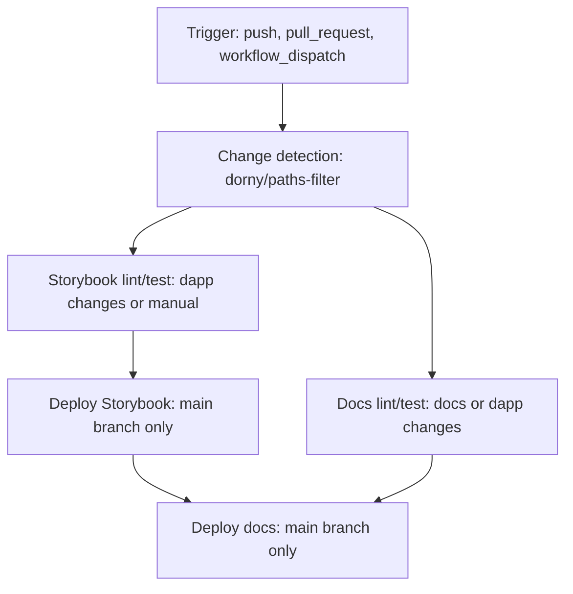

import { Callout, Table } from 'nextra/components'

# Docs and Storybook Pipeline

This pipeline ships the docs site and the UI Storybook. It uses path filtering to avoid unnecessary runs and separates dapp lint/test from docs lint/test.

## Triggers and change detection

<Table>
  <thead>
    <tr>
      <th>Trigger</th>
      <th>Details</th>
    </tr>
  </thead>
  <tbody>
    <tr>
      <td>push / pull_request</td>
      <td>Runs on <code>main</code> for changes in <code>dapp/&#42;&#42;</code> or <code>docs/&#42;&#42;</code></td>
    </tr>
    <tr>
      <td>workflow_dispatch</td>
      <td>Manual run from GitHub Actions UI</td>
    </tr>
    <tr>
      <td>paths-filter</td>
      <td>Sets <code>dapp</code> and <code>docs</code> flags for conditional jobs</td>
    </tr>
  </tbody>
</Table>

<Callout type="warning">
  Workflow or action file changes alone do not trigger this pipeline. Use <code>workflow_dispatch</code>
  when adjusting CI/CD logic.
</Callout>

## Job flow

<ol>
  <li><strong>Change detection</strong>: <code>dorny/paths-filter</code> marks whether dapp or docs changed.</li>
  <li><strong>Storybook lint/test</strong>: runs only when dapp changes or manual dispatch.</li>
  <li><strong>Deploy Storybook</strong>: main branch only, runs after lint/test if dapp changed.</li>
  <li><strong>Docs lint/test</strong>: runs when docs or dapp changes, plus manual dispatch.</li>
  <li><strong>Deploy docs</strong>: main branch only, after docs lint/test, and waits for Storybook deploy if it ran.</li>
</ol>

## Workflow Diagram

## Storybook details

- Linting uses the shared <code>run-eslint</code> action with <code>strict: true</code>.
- Vitest tests run via <code>run-vitest-tests</code> with Codecov disabled.
- Deployment uses the Vercel CLI directly and publishes a prebuilt Storybook output in <code>.vercel/output</code>.

## Docs site details

- Lint and tests run inside the <code>docs</code> workspace.
- Deployment uses the <code>vercel-deploy</code> action in <code>prebuilt</code> mode (CI builds locally for stability).

<Callout type="info">
  Docs deploy waits for Storybook deploy if the dapp changed. If Storybook lint/test or deploy fails,
  docs deploy is blocked. If Storybook did not run, docs deploy proceeds once docs lint/test succeeds.
</Callout>

<Callout type="info">
  Remote Vercel builds are still available if we want to switch back (flip <code>mode</code> to
  <code>remote</code> in the deploy job).
</Callout>

## Required secrets

<Table>
  <thead>
    <tr>
      <th>Name</th>
      <th>Used for</th>
    </tr>
  </thead>
  <tbody>
    <tr>
      <td>VERCEL_TOKEN</td>
      <td>Storybook deploy and docs deploy</td>
    </tr>
    <tr>
      <td>VERCEL_ORG_ID</td>
      <td>Storybook deploy and docs deploy</td>
    </tr>
    <tr>
      <td>VERCEL_PROJECT_ID</td>
      <td>Storybook deploy and docs deploy</td>
    </tr>
  </tbody>
</Table>
