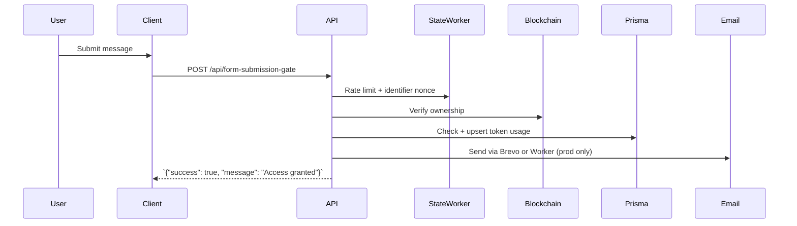

import { FileTree, Steps, Table, Tabs, Callout } from 'nextra/components'
import SwaggerDocs from '@components/utilities/swaggerdocs/SwaggerDocs'

# Form Submission Gate API

`/api/form-submission-gate` processes the single message that each Colored Key holder can submit after unlocking the gate. The route:

- Confirms the request is rate-limit compliant (`formSubmissionGate` bucket, 10 requests / 60s)
- Re-validates the legacy signature + timestamp (non-SIWE flow) before accepting user generated content
- Confirms the caller still owns the requested token on-chain
- Ensures the token has not been used already, then marks it as used inside the chain-specific Prisma table
- Sends the gated message to operators via Brevo or a Cloudflare Worker email relay
- Optionally triggers the **Backdoor Token** helper to reset testing tokens after use

The handler is forced onto the Node runtime (`runtime = 'nodejs'`) so it can perform viem RPC calls and stream structured logs consistently across environments.

## Endpoint Highlights

- Legacy EIP-191 signature authentication via `assertLegacyAuth` with timestamp + host/domain binding.
- Rate limited via the Durable Object state service: 10 requests / 60 seconds per identifier, plus a global bucket.
- Node runtime (`runtime = 'nodejs'`) for viem RPC calls and consistent structured logs across environments.

## Request Format

The body is validated by `FormSubmissionRequestSchema` (`dapp/app/schemas/dto/form-submission-gate.dto.ts`). The canonical JSON schema and live examples are defined in the OpenAPI Reference below; this TypeScript interface mirrors that shape for client code:

```ts
interface FormSubmissionRequest {
  tokenId: string | number      // Token being used
  message: string               // Up to 10,000 characters
  signature: `0x${string}`      // Legacy EIP-191 signature (65 bytes)
  address: `0x${string}`        // Lowercase wallet address
  timestamp: number             // ms since epoch (5 minute freshness window)
}
```

Key behavioral constraints:

<Table>
  <thead>
    <tr>
      <th>Field</th>
      <th>Required</th>
      <th>Behavior</th>
    </tr>
  </thead>
  <tbody>
    <tr>
      <td>`tokenId`</td>
      <td>Yes</td>
      <td>Coerced into a number. IDs outside the JS `Number.MAX_SAFE_INTEGER` range are rejected.</td>
    </tr>
    <tr>
      <td>`message`</td>
      <td>Yes</td>
      <td>Raw token-holder message (up to 10,000 characters). HTML is escaped before hitting email providers.</td>
    </tr>
    <tr>
      <td>`signature`</td>
      <td>Yes</td>
      <td>Legacy EIP-191 signature over the bound envelope (`buildLegacyExpectedMessage`). Compact signatures are rejected.</td>
    </tr>
    <tr>
      <td>`address`</td>
      <td>Yes</td>
      <td>Checksum-agnostic; normalized to lowercase before verification and downstream logging.</td>
    </tr>
    <tr>
      <td>`timestamp`</td>
      <td>Yes</td>
      <td>Milliseconds or seconds accepted. Requests older than 5 minutes or in the future are rejected.</td>
    </tr>
  </tbody>
</Table>

### Signing Expectations

The client reuses the same envelope as `/api/gate-access` in legacy mode:

```
I own key #${tokenId}
Domain: ${domain}
Path: /api/form-submission-gate
Method: POST
ChainId: ${chainId}
Timestamp: ${timestamp}
```

Use `@lib/client/signing.ts` helpers (`buildEnvelope` + `buildBoundMessage`) to avoid drift.

<Callout type="info">
Signatures, addresses, and token IDs are all validated via the shared schemas in [Security Schemas](/dapp/environment-configuration#security-schemas-shared-zod-helpers). Sending a compact signature or mixed-case address will be rejected before business logic runs.
</Callout>

To keep validation logic reusable outside the API route, `app/schemas/domain/form-submission-gate.domain.ts` exposes:

- `validateFormSubmission()` – performs the same guard-rails as the DTO (required fields, max message length, tokenId coercion/limits) and returns typed success/error objects. Useful when you need to lint payloads before hitting the API.
- `formatAddress()` – shortens addresses (`0x1234…abcd`) exactly the way the Brevo/worker email templates and server logs do.

If you’re building tooling around the gate, import these helpers instead of re‑implementing the checks.

## Response Behavior

On success, responses are derived from `FormSubmissionSuccessResponseSchema`:

```json
{
  "success": true,
  "message": "Access granted"
}
```

Additional behavior:

- The token is marked as used in the chain-specific Prisma table once ownership is confirmed. Unknown tokens are created as "used" entries rather than returning 404.
- Validation failures (invalid JSON, Zod errors, malformed `tokenId`) return RFC 7807 problem details.
- Authentication and authorization failures (signature mismatch, stale timestamp, host not on allowlist, token already used) also return RFC 7807 payloads with appropriate 4xx codes.
- Rate limit errors (`429`) include `Retry-After` and `X-RateLimit-*` headers so clients can back off.
- Infrastructure failures (on-chain read, email provider, DB upsert) return `5xx` problem responses in production.

For exhaustive status codes and concrete example payloads, use the OpenAPI Reference below as the canonical source of truth.

## API Reference (OpenAPI)

This embedded Swagger UI is the canonical specification for `/api/form-submission-gate`, including the full request/response schema, status codes, and example payloads.

<SwaggerDocs tag="Form Submission Gate"  />

## Execution Flow

<Steps>
### 1. Rate Limit + JSON Validation
Requests are throttled through the Durable Object state service (`checkRateLimitWithNonce`). Invalid JSON returns `400`.

### 2. Legacy Authentication
`assertLegacyAuth` replays the original message, enforces domain/host allowlists, and ensures the timestamp is fresh.

### 3. Ownership Checks
The handler reads `getTokenOfOwner` via viem against the active chain, ensuring the caller still owns the token they are attempting to spend.

### 4. Database Mutations
The Prisma delegate for the active chain is queried to ensure the token isn’t already used, then upserted to mark it as consumed.

### 5. Email Dispatch + Backdoor (Optional)
In production, the request is relayed via Brevo or the Cloudflare worker. Successful writes can trigger the backdoor reset helper for designated tokens.
</Steps>



## Email Delivery Modes

<Tabs items={['Direct Brevo', 'Cloudflare Worker']}>
  <Tabs.Tab>
    Env snippet:
    ```bash
    USE_CLOUDFLARE_WORKER=false
    BREVO_API_KEY=...
    SENDER_EMAIL=noreply@ritoswap.com
    RECEIVER_EMAIL=admin@ritoswap.com
    ```
    - Emails are sent inline with the request and must succeed before the response is returned.
    - Ideal for low-volume environments or local debugging (non-production requests short-circuit the email step).
  </Tabs.Tab>
  <Tabs.Tab>
    Env snippet:
    ```bash
    USE_CLOUDFLARE_WORKER=true
    CLOUDFLARE_WORKER_URL=https://ritoswap-email.worker.dev
    ```
    - The worker (`dapp/cloudflare/src/routes/email.ts`) relays Brevo calls and keeps API latency low.
    - Ensure the worker secrets (`BREVO_API_KEY`, `SENDER_EMAIL`, `RECEIVER_EMAIL`) are set via `pnpm secret:*`.
  </Tabs.Tab>
</Tabs>

## Automated Coverage

<Callout type="info">
See [Testing & QA → Supertest](/dapp/supertest) for the full harness notes.
</Callout>

- `dapp/e2e/supertest/api.test.ts` signs the same legacy envelope described above (using `createLegacySignature`) and posts it to `/api/form-submission-gate` for both a real token (`happyPath`) and an intentionally invalid token (`sadPath`).  
- The test tolerates documented 403/429/500 responses, logs the body when the server reports a 500, and still asserts that 200 responses contain `success` so regressions in the gate’s success payload are caught.  
- Because only the legacy flow is supported today, the suite runs even when `NEXT_PUBLIC_ENABLE_STATE_WORKER=true`; there is no SIWE variant for this route.

## Backdoor Token Reset (Optional)

When `BACKDOOR_TOKEN=true` (and `TOKEN_ID`/`BACKDOOR_ADDRESS` are configured in server env) the API schedules a reset via `@lib/backdoorToken/BackdoorToken`. This is primarily for QA or demo scenarios where a designated token should automatically become reusable moments after exercising the gate.

<Callout type="warning">
Backdoor resets are permanently disabled unless both `BACKDOOR_TOKEN=true` and `TOKEN_ID` are configured. In production, the helper also requires `BACKDOOR_ADDRESS` to match the caller.
</Callout>

## File Locations

<FileTree>
  <FileTree.Folder name="app/api/form-submission-gate">
    <FileTree.File name="route.ts" />
    <FileTree.File name="__tests__/route.test.ts" />
  </FileTree.Folder>
  <FileTree.Folder name="app/schemas/dto">
    <FileTree.File name="form-submission-gate.dto.ts" />
  </FileTree.Folder>
  <FileTree.Folder name="app/lib/backdoorToken">
    <FileTree.File name="BackdoorToken.ts" />
  </FileTree.Folder>
</FileTree>
