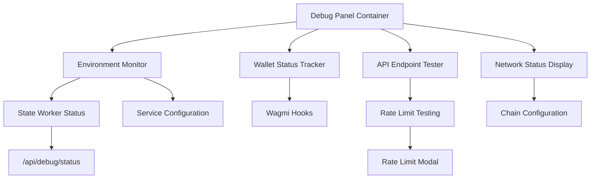

import { FileTree, Steps, Table, Tabs, Callout, Cards } from 'nextra/components'
import { DebugPanelShowcase } from '@components/mockui/DebugPanelUI'

# Debug Panel

The Debug Panel serves as an essential development tool for RitoSwap, providing real-time visibility into the dApp's environment state, infrastructure connectivity, and API functionality. Designed exclusively for development environments, this floating diagnostic interface offers instant insights into critical system parameters without requiring external debugging tools or console access.

## System Overview

The Debug Panel operates as a comprehensive monitoring solution that aggregates data from multiple sources across the RitoSwap architecture. By presenting this information in a unified, always-accessible interface, developers can quickly diagnose configuration issues, verify service connectivity, and test rate limiting behavior without leaving the application context.

### Core Functionality Areas

The Debug Panel provides real-time monitoring and testing capabilities across four primary domains:

<Cards>
  <Cards.Card title="Environment Monitoring" href="#environment-variables-tracking">
    Real-time display of critical environment variables and service configurations
  </Cards.Card>
  <Cards.Card title="Wallet State Tracking" href="#wallet-connection-monitoring">
    Current wallet connection status and active account information
  </Cards.Card>
  <Cards.Card title="API Endpoint Testing" href="#endpoint-testing-interface">
    Interactive testing of rate-limited endpoints with visual feedback
  </Cards.Card>
  <Cards.Card title="Network Diagnostics" href="#network-and-chain-configuration">
    Chain configuration verification and network connectivity status
  </Cards.Card>
</Cards>

## Architecture and Integration

The Debug Panel implements a client-side monitoring architecture that interfaces with various system components to provide comprehensive diagnostics. The panel operates independently of the main application flow, ensuring that debugging activities don't interfere with normal dApp operations.

### Component Structure

The Debug Panel consists of several interconnected modules that work together to provide real-time diagnostics:



### Data Flow and Updates

The Debug Panel maintains real-time accuracy through multiple update mechanisms. Environment variable states are evaluated on component mount and remain static during the session. State-worker diagnostics are fetched from the `/api/debug/status` endpoint on initial load. Wallet connection information updates automatically through wagmi hooks whenever account or chain changes occur. Network connectivity status is monitored through a one-second interval check of `navigator.onLine`.

### Interactive Demo

At the bottom right of your screen is an interactive demo version of the Debug Panel. Click the **"🐛 Debug"** button to open it, and the **minimize** icon on the top right to close it. If you look below this text you'll see **checkmarks** corresponding to the written properties in the Debug Panel, you can **toggle** the Panel's properties through these checkmarks.
<br />

<DebugPanelShowcase />

## Environment Variables Tracking

The environment monitoring section provides instant visibility into the configuration state of critical services and features. This comprehensive overview helps developers quickly identify misconfigurations that might affect functionality.

### Service Configuration Indicators

The panel displays the status of each service using clear visual indicators:

<Table>
  <thead>
    <tr>
      <th>Indicator</th>
      <th>Service</th>
      <th>Configuration Check</th>
    </tr>
  </thead>
  <tbody>
    <tr>
      <td>PWA Enabled</td>
      <td>Progressive Web App</td>
      <td>`NEXT_PUBLIC_SW === 'true'`</td>
    </tr>
    <tr>
      <td>SIWE Enabled</td>
      <td>Sign-In with Ethereum</td>
      <td>`NEXT_PUBLIC_ENABLE_STATE_WORKER === 'true'`</td>
    </tr>
    <tr>
      <td>Rate Limit Enabled</td>
      <td>API Rate Limiting</td>
      <td>`NEXT_PUBLIC_ENABLE_STATE_WORKER === 'true'`</td>
    </tr>
    <tr>
      <td>State Worker URL</td>
      <td>Durable Object Endpoint</td>
      <td>`STATE_WORKER_URL` is set and reachable</td>
    </tr>
    <tr>
      <td>State Worker Key</td>
      <td>Durable Object Authentication</td>
      <td>`STATE_WORKER_API_KEY` is set and valid</td>
    </tr>
  </tbody>
</Table>

### Domain Configuration Display

The Debug Panel provides detailed domain configuration information essential for SIWE authentication setup. It displays both the active domain being used for authentication and the source of that domain configuration. When `NEXT_PUBLIC_DOMAIN` is set, the panel shows the configured value. If not set, it falls back to browser location and indicates "Not Set (using browser)" to clarify the fallback behavior.

<Callout type="info">
The domain configuration directly impacts SIWE message generation and must match the actual deployment domain for production environments.
</Callout>

## Wallet Connection Monitoring

The wallet status section provides real-time visibility into the current Web3 connection state, essential for debugging wallet-related functionality and ensuring proper account detection.

### Connection State Indicators

The panel displays two primary wallet indicators that update automatically through wagmi hooks integration. The connection status shows a green checkmark when a wallet is successfully connected or a red X when disconnected. The wallet address displays either the truncated address format (0x1234...5678) when connected or "Not Connected" when no wallet is active.

### Account Switching Detection

The Debug Panel automatically detects and reflects account changes without requiring manual refresh. When users switch accounts in their wallet, the panel immediately updates to show the new address, maintaining synchronization with the dApp's authentication state. This real-time updating helps developers verify that account switching logic is functioning correctly throughout the application.

## Network and Chain Configuration

The network configuration section provides critical visibility into blockchain network settings, helping developers ensure proper multi-chain support and configuration.

### Target Chain Resolution

The Debug Panel displays the active target chain based on environment configuration precedence:

```typescript
// Configuration precedence logic
switch (NEXT_PUBLIC_ACTIVE_CHAIN) {
  case 'ritonet':
    return 'RitoNet (90999999)'
  case 'sepolia':
    return 'Sepolia (11155111)'
  default:
    return 'Ethereum (1)'
}
```

### Chain Mismatch Detection

The panel displays both the target chain (configured) and current chain (wallet connection), enabling quick identification of chain mismatches. This dual display helps developers diagnose issues where users are connected to the wrong network, a common source of transaction failures in multi-chain dApps.

<Table>
  <thead>
    <tr>
      <th>Scenario</th>
      <th>Target Chain</th>
      <th>Current Chain</th>
      <th>Implication</th>
    </tr>
  </thead>
  <tbody>
    <tr>
      <td>Properly Connected</td>
      <td>Sepolia (11155111)</td>
      <td>11155111</td>
      <td>Transactions will succeed</td>
    </tr>
    <tr>
      <td>Chain Mismatch</td>
      <td>Sepolia (11155111)</td>
      <td>1</td>
      <td>Transactions will fail</td>
    </tr>
    <tr>
      <td>Disconnected</td>
      <td>Sepolia (11155111)</td>
      <td>Not Connected</td>
      <td>No Web3 functionality</td>
    </tr>
  </tbody>
</Table>

## Endpoint Testing Interface

The endpoint testing section enables interactive verification of API functionality and rate limiting behavior directly from the development interface. This feature proves invaluable for testing authentication flows and understanding rate limit thresholds.

### Available Test Endpoints

The Debug Panel provides one-click testing for critical token gate endpoints:

<FileTree>
  <FileTree.Folder name="API Endpoints" defaultOpen>
    <FileTree.File name="/api/nonce - SIWE nonce generation" />
    <FileTree.File name="/api/gate-access - Token gate authentication" />
    <FileTree.File name="/api/verify-token-gate - Gated verification helper" />
    <FileTree.File name="/api/token-status/1 - Token state checking" />
  </FileTree.Folder>
</FileTree>

### Request Simulation

Each test button simulates the actual API request that would occur during normal dApp operation:

```typescript
// Example request simulation for gate access
const testGateAccess = async () => {
  const body = {
    address: address || '0x0000000000000000000000000000000000000000',
    signature: '0x00',
    tokenId: 1,
    timestamp: Date.now(),
  }

  const response = await fetch('/api/gate-access', {
    method: 'POST',
    headers: { 'Content-Type': 'application/json' },
    body: JSON.stringify(body),
  })

  return response.json()
}

// Example request simulation for /api/verify-token-gate
const testVerifyToken = async () => {
  const body = {
    tokenId: 1,
    message: 'Test message',
    signature: '0x00',
    signMessage: 'Test sign message',
    address: address || '0x0000000000000000000000000000000000000000',
    timestamp: Date.now(),
  }

  const response = await fetch('/api/verify-token-gate', {
    method: 'POST',
    headers: { 'Content-Type': 'application/json' },
    body: JSON.stringify(body),
  })

  return response.json()
}
```

### Response Display

Test results appear inline next to each endpoint button, showing abbreviated response data. Success responses display the HTTP status code and truncated JSON response. Rate limit responses trigger the specialized rate limit modal with detailed information. Error states show the error type and message for debugging.

## Rate Limiting Visualization

The Debug Panel includes sophisticated rate limit testing capabilities that help developers understand and verify rate limiting behavior without triggering actual service disruptions.

### Rate Limit Modal Integration

When rate limits are exceeded during testing, the Debug Panel displays a dedicated modal that provides comprehensive rate limit information:


The modal displays the specific limit configuration (requests per window), remaining requests in the current window, and exact time until the rate limit resets. This transparency helps developers understand rate limiting behavior and plan appropriate retry strategies.

### Rate Limit Testing Strategy

The Debug Panel enables controlled rate limit testing through rapid endpoint clicking. Developers can intentionally trigger rate limits to verify proper error handling and user feedback mechanisms. The visual feedback ensures that rate limiting provides clear guidance rather than mysterious failures.

<Callout type="warning">
Rate limits in development environments typically reset more frequently (per minute) than production environments (per hour) to facilitate testing.
</Callout>

## Offline Mode Behavior

The Debug Panel includes comprehensive offline detection and visual feedback to help developers test offline scenarios and ensure graceful degradation.

### Visual Offline Indicators

When the browser loses network connectivity, the Debug Panel provides multiple visual cues. The minimized state adds a red circle emoji (🔴) next to the debug text. The expanded panel shows "Network Status: 🔴 Offline" in the environment variables. The panel header appends "(Offline)" to the title text. All API test buttons become disabled with reduced opacity.

### Offline Testing Capabilities

The offline detection enables developers to test how the dApp behaves without network connectivity. By monitoring `navigator.onLine` status, developers can verify that offline states are properly communicated to users and that the application gracefully handles network interruptions without crashes or confusion.

## Minimized State and Persistence

The Debug Panel implements an intelligent minimize feature that maintains accessibility while reducing visual footprint during regular development activities.

### Minimization Behavior

The panel can be minimized to a compact pill-shaped indicator in the bottom-right corner. The minimized state preserves all internal state and test results, shows online/offline status at a glance, and can be restored with a single click. This design allows developers to keep the debug panel available without obscuring application content.

### State Preservation

When minimized and restored, the Debug Panel maintains all previous test results and responses, current environment variable readings, active wallet connection information, and any rate limit states or warnings. This persistence ensures that diagnostic information isn't lost during normal development workflows.

## Mobile Responsiveness

The Debug Panel implements responsive design principles to ensure functionality across all device sizes, crucial for testing mobile wallet interactions.

### Responsive Breakpoints

<Tabs items={['Desktop View', 'Mobile View']}>
  <Tabs.Tab>
    ### Desktop Layout (>768px)
    
    The desktop layout provides optimal information density with a 400px width panel, full 600px maximum height for scrolling content, extended environment value display (200px), and side-by-side test result presentation. This layout maximizes the amount of diagnostic information visible at once while maintaining readability.
  </Tabs.Tab>
  <Tabs.Tab>
    ### Mobile Layout (≤768px)
    
    The mobile layout adapts to smaller screens through several adjustments. The panel width reduces to 320px to fit mobile viewports. Maximum height decreases to 400px for better mobile ergonomics. Environment value width constrains to 150px to prevent overflow. Padding reduces throughout for more efficient space usage. These adaptations ensure the Debug Panel remains functional on mobile devices where debugging Web3 interactions is often most challenging.
  </Tabs.Tab>
</Tabs>

### Touch Interaction Optimization

The Debug Panel optimizes for touch interfaces by implementing larger tap targets for all interactive elements, increased spacing between buttons to prevent mis-taps, smooth scrolling for content sections, and tap-to-dismiss functionality for modals. These optimizations ensure developers can effectively use the Debug Panel on mobile devices during testing.

## Security and Production Safety

The Debug Panel implements multiple safeguards to ensure it never appears in production environments, protecting sensitive configuration information.

### Environment Detection

The panel includes strict environment checking at multiple levels:

```typescript
// Client-side visibility check
useEffect(() => {
  setIsVisible(process.env.NODE_ENV === 'development')
}, [])

// Server-side API protection
if (process.env.NODE_ENV !== 'development') {
  return NextResponse.json({ error: 'Not available' }, { status: 404 })
}
```

### Information Exposure Considerations

While the Debug Panel only appears in development, it's important to understand what information it exposes. Environment variable names and states (not values) are visible in the panel. Wallet addresses are shown in truncated format. API endpoint paths are displayed but not internal implementation details. State worker configuration status is indicated without revealing secrets.

<Callout type="error">
Never modify the Debug Panel to display sensitive values like API keys, private keys, or connection strings, even in development environments.
</Callout>

## Implementation Guide

Integrating the Debug Panel into a dApp requires careful setup to ensure all monitoring capabilities function correctly.

### Basic Integration

To add the Debug Panel to your dApp, first import the component and its styles:

```typescript
import DebugPanel from '@/components/debug/DebugPanel'
```

Then include it in your root layout or app component:

```tsx
export default function RootLayout({ children }) {
  return (
    <html>
      <body>
        {children}
        <DebugPanel />
      </body>
    </html>
  )
}
```

### Configuration Dependencies

The Debug Panel relies on several configuration services to provide accurate information:

<Table>
  <thead>
    <tr>
      <th>Feature</th>
      <th>Required Setup</th>
      <th>Configuration Files</th>
    </tr>
  </thead>
  <tbody>
    <tr>
      <td>Wallet Monitoring</td>
      <td>Wagmi provider configuration</td>
      <td>`providers.tsx`</td>
    </tr>
    <tr>
      <td>State Worker Status</td>
      <td>Debug status API endpoint</td>
      <td>`/api/debug/status/route.ts`</td>
    </tr>
    <tr>
      <td>Chain Configuration</td>
      <td>Chain config utilities</td>
      <td>`utils/chainConfig.ts`</td>
    </tr>
    <tr>
      <td>Rate Limit Modal</td>
      <td>Rate limit modal component</td>
      <td>`components/RateLimitModal.tsx`</td>
    </tr>
  </tbody>
</Table>

### Custom Styling

The Debug Panel uses CSS modules with CSS custom properties for theming:

```css
/* Override default colors in your global styles */
:root {
  --primary-color: #007bff;
  --secondary-color: #0056b3;
  --default-border: 2px solid #0056b3;
}
```

## Advanced Customization

The Debug Panel architecture supports extensive customization for specific debugging needs.

### Adding Custom Endpoints

To add new API endpoints for testing, modify the endpoints array:

```typescript
const endpoints: EndpointTest[] = [
  // Existing endpoints...
  {
    name: 'Custom API',
    endpoint: '/api/custom',
    method: 'POST',
    getBody: () => ({
      customParam: 'value',
      timestamp: Date.now()
    })
  }
]
```

### Extending Environment Monitoring

Add new environment checks to the envVars object:

```typescript
const envVars = {
  // Existing variables...
  'Custom Service': process.env.NEXT_PUBLIC_CUSTOM_SERVICE === 'true' ? '✅' : '❌',
  'Feature Flag X': featureFlags.isEnabled('feature-x') ? '✅' : '❌',
}
```

### Creating Custom Sections

The Debug Panel's modular structure allows adding entirely new monitoring sections:

```tsx
<div className={styles.section}>
  <h4>Custom Metrics</h4>
  <div className={styles.envList}>
    {/* Custom monitoring content */}
  </div>
</div>
```

## Best Practices

Effective use of the Debug Panel requires understanding its intended role in the development workflow.

### Development Workflow Integration

The Debug Panel should remain visible during active development to catch configuration issues early. Use endpoint testing before implementing full UI flows to verify API behavior. Monitor chain configuration when testing multi-chain functionality. Check the state worker status before testing SIWE authentication flows.

### Debugging Strategies

When troubleshooting issues, follow a systematic approach. First, verify all environment indicators show expected states. Next, test relevant endpoints to confirm API connectivity. Then, check wallet connection and chain alignment. Finally, monitor network status for connectivity issues. This ordered approach helps isolate problems quickly.

### Performance Considerations

While the Debug Panel is lightweight, consider these performance aspects. The one-second network monitoring interval has minimal impact. API status checking occurs only on mount, not continuously. The panel renders outside the main React tree to avoid re-render cascades. CSS-based animations ensure smooth minimize/maximize transitions.

## Common Issues and Solutions

Understanding common Debug Panel scenarios helps resolve issues quickly.

### State Worker Shows Disconnected

When the state worker indicator shows ❌, verify that `NEXT_PUBLIC_ENABLE_STATE_WORKER` is `true`, `STATE_WORKER_URL` points to a reachable `/state` route, and `STATE_WORKER_API_KEY` matches the secret configured in the worker. Remember that the worker is optional for purely legacy flows but required for SIWE and rate limiting.

### Endpoint Tests Fail Immediately

If all endpoint tests fail instantly, confirm the development server is running, check for CORS issues in browser console, verify API routes are properly configured, and ensure the Debug Panel is running in development mode. The `/api/debug/status` endpoint specifically requires development environment.

### Rate Limit Modal Not Appearing

If rate limiting tests don't trigger the modal, verify the rate limit library is properly initialized, ensure the state worker is enabled (required for rate limiting), confirm `showRateLimitModal` is available globally, and ensure rate limit middleware is applied to test endpoints.

## Summary

The Debug Panel represents an essential development tool that significantly accelerates dApp debugging and configuration verification. By providing real-time visibility into environment state, service connectivity, and API functionality, it eliminates the guesswork often associated with Web3 development.

The panel's thoughtful design balances comprehensive monitoring capabilities with a non-intrusive interface that adapts to different development workflows. Whether tracking down chain mismatches, verifying SIWE configuration, or testing rate limits, the Debug Panel provides immediate feedback that helps developers build more robust dApps.

For teams building Web3 applications, implementing a similar debug panel should be considered a best practice. The investment in creating development-specific tooling pays dividends through reduced debugging time, faster issue resolution, and increased confidence in configuration correctness. The Debug Panel exemplifies how development tools can be both powerful and pleasant to use, setting a standard for developer experience in the Web3 ecosystem.
