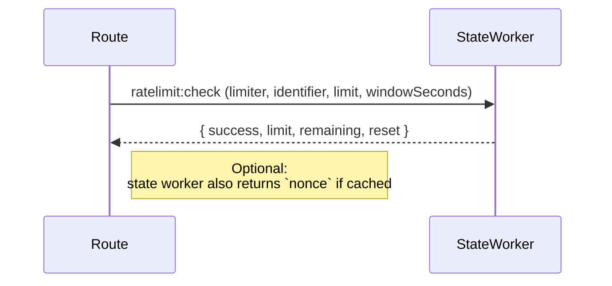

import { FileTree, Table, Steps, Callout } from 'nextra/components'

# Rate Limiting Library

All token-gate APIs share a Cloudflare Durable Object that tracks request volume, SIWE nonces, and quotas. The server-side helpers in `dapp/app/lib/rateLimit/rateLimit.server.ts` wrap that worker so every request—whether it lands on Vercel, a local dev server, or another host—pulls from the exact same counters.

The library exposes:

- `isRateLimitEnabled()` – true only when `NEXT_PUBLIC_ENABLE_STATE_WORKER=true`, the state worker creds exist, and the worker client can initialize.
- `checkRateLimitWithNonce()` – applies a per-endpoint limiter, an optional global limiter, and opportunistically returns the cached nonce for SIWE flows.
- Helpers for extracting client identifiers and translating limiter metadata into HTTP headers (`X-RateLimit-*`, `Retry-After`).

## Architecture Overview

1. **Client identifier** – derived from `x-forwarded-for` (production) or the request socket/IP (everywhere else) via `getIdentifier`.
2. **Per-endpoint limiter** – configuration-driven (`RATE_LIMITER_CONFIGS`) and enforced by the Durable Object (`state:ratelimit:check` action).
3. **Global limiter** – optional 200 req/hour bucket for most endpoints (token-status polling is exempt).
4. **Nonce lookup** – the same worker stores SIWE nonces; if one already exists for the identifier it is injected into the limiter response to avoid redundant writes.



## Configuration

```bash
NEXT_PUBLIC_ENABLE_STATE_WORKER=true
STATE_WORKER_URL=https://ritoswap-state-worker.worker.dev/state
STATE_WORKER_API_KEY=your_shared_secret
```

Disable the flag locally to bypass rate limits entirely while iterating. In production, the worker must be reachable before any route can perform SIWE or rate-limited operations.

## Limiter Catalog

<Table>
  <thead>
    <tr>
      <th>Limiter</th>
      <th>Limit</th>
      <th>Window</th>
      <th>Prefix</th>
      <th>Purpose</th>
    </tr>
  </thead>
  <tbody>
    <tr>
      <td>`nonce`</td>
      <td>30</td>
      <td>60s</td>
      <td>`rl:nonce:`</td>
      <td>SIWE nonce generation attempts</td>
    </tr>
    <tr>
      <td>`gateAccess`</td>
      <td>60</td>
      <td>60s</td>
      <td>`rl:gate-access:`</td>
      <td>Main gate unlock endpoint</td>
    </tr>
    <tr>
      <td>`formSubmissionGate`</td>
      <td>10</td>
      <td>60s</td>
      <td>`rl:form-submission:`</td>
      <td>Single-use message submission endpoint</td>
    </tr>
    <tr>
      <td>`tokenStatus`</td>
      <td>60</td>
      <td>60s</td>
      <td>`rl:token-status:`</td>
      <td>High-frequency polling for UI updates (no global limiter)</td>
    </tr>
    <tr>
      <td>`global`</td>
      <td>200</td>
      <td>3600s</td>
      <td>`rl:global:`</td>
      <td>Catch-all protection shared across most routes</td>
    </tr>
  </tbody>
</Table>

The configuration lives in `RATE_LIMITER_CONFIGS` and feeds both the worker payload (`limit`, `windowSeconds`) and the doc site.

## Request Lifecycle

<Steps>
### 1. Identifier Extraction
`getIdentifier(req)` prioritizes `x-forwarded-for`, falls back to `x-real-ip`, and finally `req.ip`. Development requests default to `127.0.0.1` so the limiter remains stable between reloads.

### 2. Per-Route Check
`applyLimiter(type, identifier)` calls `getStateClient().checkRateLimit(...)`. Failures (network issues, worker downtime) are logged and treated as `success: true` to avoid blocking the app.

### 3. Optional Global Check
For everything except `tokenStatus`, a second limiter (`global`) is evaluated to cap total throughput per identifier.

### 4. Nonce Lookup
When SIWE is enabled, the helper also tries `getStateClient().getNonce(identifier)` so `/api/nonce` can reuse the cached value without performing another worker round trip.

### 5. Response Headers
When a request is throttled, `rateLimitResponse` computes `Retry-After`, `X-RateLimit-Limit`, and `X-RateLimit-Remaining` and attaches them to the 429 response.
</Steps>

## Surfacing to APIs

Routes typically integrate like this:

```ts
const result = await checkRateLimitWithNonce(request, 'gateAccess');
if (!result.success) {
  return rateLimitResponse(result, 'Rate limit exceeded');
}
// result.nonce may contain a SIWE nonce for reuse
```

- `/api/gate-access` passes `'gateAccess'` and leaves `includeGlobal` at `true`.
- `/api/token-status/[tokenId]` uses `'tokenStatus'` and explicitly sets `includeGlobal=false` to keep polling responsive.
- `/api/form-submission-gate` uses `'formSubmissionGate'` before parsing any user content, protecting the most expensive code path.

## Testing & Debugging

`dapp/app/lib/rateLimit/__tests__/rateLimit.server.test.ts` verifies:

- Rate-limit enablement gating via env + state service checks
- Identifier extraction fallbacks
- Per-route limiter + global limiter ordering and short-circuit behavior
- Nonce passthrough when cached

For manual diagnostics, `/api/debug/status` responds in development with booleans indicating whether the state worker URL and API key are configured.

<Callout type="warning">
Because all rate limiting, nonce storage, and quota tracking shares the same Durable Object, never expose its `STATE_WORKER_API_KEY` publicly. The worker authenticates every request coming from the Next.js app.
</Callout>

## File Locations

<FileTree>
  <FileTree.Folder name="app/lib/rateLimit">
    <FileTree.File name="rateLimit.server.ts" />
    <FileTree.File name="rateLimit.client.ts" />
    <FileTree.File name="__tests__/rateLimit.server.test.ts" />
  </FileTree.Folder>
  <FileTree.Folder name="app/lib/state">
    <FileTree.File name="client.ts" />
    <FileTree.File name="types.ts" />
  </FileTree.Folder>
  <FileTree.Folder name="cloudflare/src">
    <FileTree.Folder name="routes">
      <FileTree.File name="state.ts" />
    </FileTree.Folder>
    <FileTree.Folder name="durable">
      <FileTree.File name="state.ts" />
    </FileTree.Folder>
  </FileTree.Folder>
</FileTree>
