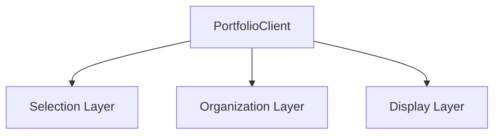
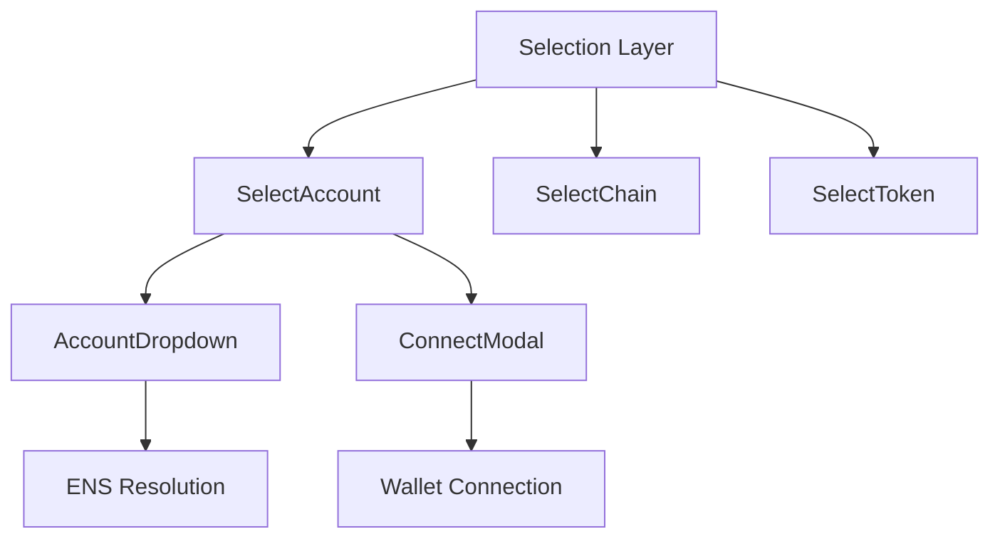
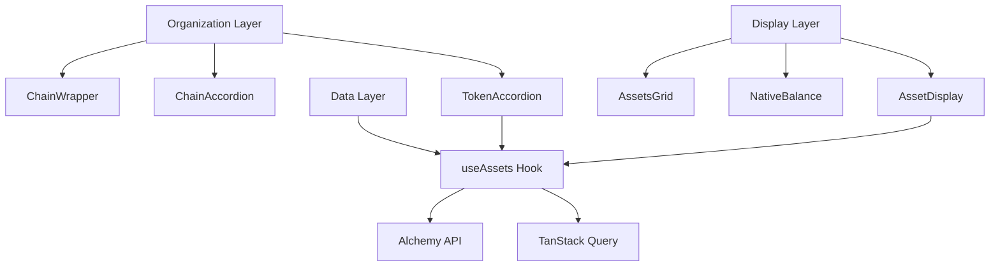
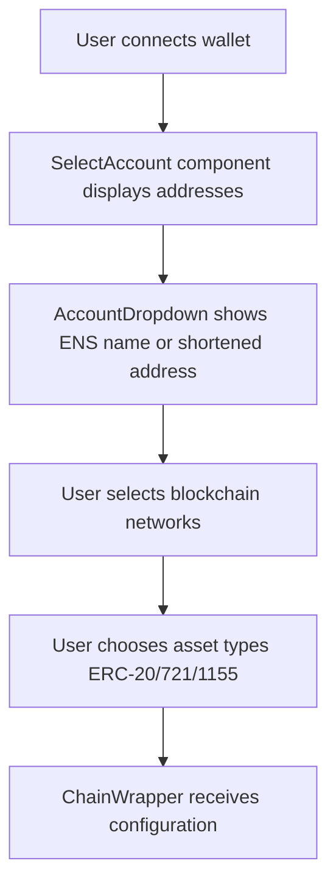
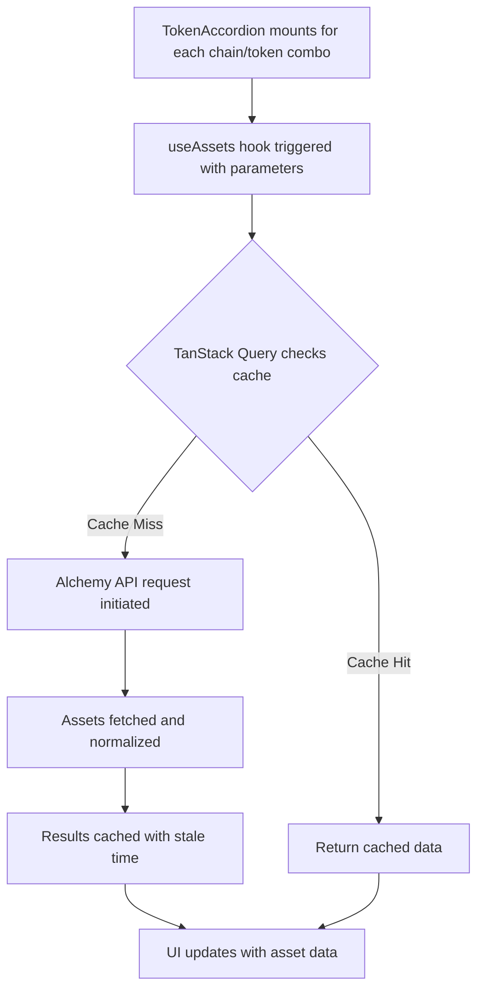
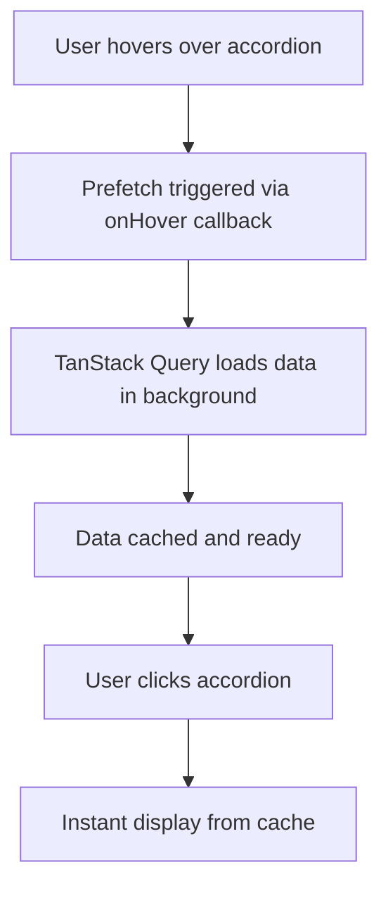

import { Callout, FileTree, Cards } from 'nextra/components'

# Portfolio UI System

The Portfolio UI is a sophisticated multi-chain asset viewing system that enables users to explore their digital assets across multiple EVM-compatible blockchains. Built with React, TanStack Query, and wagmi, it provides real-time asset discovery with intelligent caching and prefetching capabilities.

 

 
## Core Features

<Cards num={2}>
  <Cards.Card title="Multi-Chain Support" href="#multi-chain-architecture">
    View assets across Ethereum, Polygon, Arbitrum, Avalanche, Base, Optimism, and more
  </Cards.Card>
  <Cards.Card title="Comprehensive Asset Types" href="#supported-assets">
    ERC-20 tokens, ERC-721 NFTs, and ERC-1155 multi-tokens with native currency balances
  </Cards.Card>
</Cards>

<Cards num={2}>
  <Cards.Card title="Real-Time Updates" href="#data-fetching">
    Powered by Alchemy API with intelligent caching via TanStack Query
  </Cards.Card>
  <Cards.Card title="Animated UI" href="#user-interface">
    Smooth transitions and progressive disclosure with Framer Motion
  </Cards.Card>
</Cards>

## Architecture Overview

The portfolio system follows a layered architecture pattern that separates concerns and maximizes reusability. Due to the complexity of the system, we've broken down the architecture into three focused diagrams:

### Main Component Structure

### Selection Layer Components

<Callout type="info">
  The ConnectModal component is located at `dapp/components/utilities/wallet/connectModal/ConnectModal.tsx` and is imported by SelectAccount for wallet connection functionality.
</Callout>

### Organization and Display Layers

### Component Hierarchy

<FileTree>
  <FileTree.Folder name="portfolio" defaultOpen>
    <FileTree.File name="PortfolioClient.tsx" />
    <FileTree.Folder name="components" defaultOpen>
      <FileTree.Folder name="selection">
        <FileTree.File name="SelectAccount.tsx" />
        <FileTree.File name="SelectChain.tsx" />
        <FileTree.File name="SelectToken.tsx" />
        <FileTree.File name="AccountDropdown.tsx" />
      </FileTree.Folder>
      <FileTree.Folder name="organize">
        <FileTree.File name="ChainWrapper.tsx" />
        <FileTree.File name="ChainAccordion.tsx" />
        <FileTree.File name="TokenAccordion.tsx" />
        <FileTree.File name="Placeholder.tsx" />
      </FileTree.Folder>
      <FileTree.Folder name="assets">
        <FileTree.File name="AssetDisplay.tsx" />
        <FileTree.File name="AssetsGrid.tsx" />
        <FileTree.File name="TokenAccordionContent.tsx" />
        <FileTree.File name="NativeBalance.tsx" />
      </FileTree.Folder>
    </FileTree.Folder>
    <FileTree.Folder name="hooks">
      <FileTree.File name="useAssets.ts" />
    </FileTree.Folder>
    <FileTree.Folder name="__tests__">
      <FileTree.File name="PortfolioClient.integration.test.tsx" />
      <FileTree.File name="Content.unit.test.tsx" />
    </FileTree.Folder>
  </FileTree.Folder>
</FileTree>

## Multi-Chain Architecture

The portfolio viewer seamlessly integrates with multiple blockchain networks through a combination of wagmi's chain configuration and Alchemy's unified API endpoints.

### Supported Networks

| Network | Chain ID | Features | Testnet |
|---------|----------|----------|---------|
| Ethereum | 1 | ERC-20, ERC-721, ERC-1155 | Sepolia (11155111) |
| Polygon | 137 | ERC-20, ERC-721, ERC-1155 | - |
| Arbitrum | 42161 | ERC-20, ERC-721, ERC-1155 | - |
| Avalanche | 43114 | ERC-20 only | - |
| Base | 8453 | ERC-20, ERC-721, ERC-1155 | - |
| Optimism | 10 | ERC-20, ERC-721, ERC-1155 | - |
| Fantom | 250 | ERC-20 only | - |

<Callout type="info">
  The system automatically detects which asset types are supported on each chain and adjusts the UI accordingly. Chains without NFT support will only show ERC-20 token options.
</Callout>

## Data Flow

Understanding how data flows through the portfolio system is crucial for debugging and extending functionality:

### 1. User Selection Flow

<Callout type="info">
  ENS resolution in AccountDropdown uses `useEnsName({ chainId: 1 })` for mainnet lookup regardless of connected chain. The component displays shortened addresses immediately without explicit loading indicators while ENS resolution happens asynchronously in the background.
</Callout>

### 2. Asset Discovery Flow

### 3. Optimization Flow

## Supported Assets

The portfolio viewer handles three distinct asset types, each with specialized display logic:

### ERC-20 Tokens

Standard fungible tokens with:
- Token name and symbol
- Decimal-aware balance formatting
- Logo retrieval from Alchemy metadata
- Optional price integration support

### ERC-721 NFTs

Non-fungible tokens featuring:
- Individual token display with images
- Metadata parsing for names and descriptions
- Attribute visualization
- IPFS gateway integration for decentralized images

### ERC-1155 Multi-Tokens

Semi-fungible tokens supporting:
- Balance tracking for each token ID
- Mixed fungible/non-fungible display
- Batch metadata fetching

### Native Currencies

Each blockchain's native currency (ETH, MATIC, AVAX, etc.) is displayed separately using wagmi's balance hooks for real-time accuracy.

## User Interface

The portfolio UI implements a progressive disclosure pattern that prevents information overload while maintaining quick access to all assets:

### Visual Hierarchy

1. **Account Selection** - Primary wallet address with ENS resolution (no loading indicator shown during resolution)
2. **Network Selection** - Visual grid with chain logos and checkboxes
3. **Token Type Selection** - Simple checkbox interface for asset types
4. **Asset Display** - Nested accordions revealing assets on demand

### Animation Strategy

All transitions use Framer Motion for smooth, hardware-accelerated animations:

- **Accordion animations**: Height-based transitions with opacity fades
- **Asset grid animations**: Staggered entry for visual polish
- **Loading states**: Animated Orb placeholders for image slots plus traditional spinners for query status
- **Error states**: Contextual retry buttons with helpful messages

## Data Fetching

The portfolio leverages Alchemy's comprehensive blockchain APIs through a custom React Query implementation:

### Caching Strategy

| Asset Type | Stale Time | Rationale |
|------------|------------|-----------|
| ERC-20 | 2 minutes | Balances change frequently |
| ERC-721 | 10 minutes | NFTs change less often |
| ERC-1155 | 10 minutes | Similar to NFTs |

<Callout type="info">
  Queries rely on TanStack Query's default 5-minute <code>cacheTime</code>, so unused data is automatically garbage collected after that window unless overridden by the consumer.
</Callout>

### Prefetching

The system implements intelligent prefetching:
- Hover-based prefetch for accordion items
- Background refresh for stale data
- Pagination prefetch for large collections

### Error Recovery

Automatic retry logic with exponential backoff:
- 3 retry attempts for transient failures
- No retry for 404 errors
- Manual retry buttons for user control

## Performance Optimizations

The portfolio UI implements several performance optimizations:

### Component-Level Optimizations

- **Lazy loading**: Accordion content only mounts when opened
- **Progressive image placeholders**: OrbImage/ProgressiveImage keep logo and NFT frames stable while assets stream in

### Network-Level Optimizations

- **Request deduplication**: TanStack Query prevents duplicate API calls
- **Infinite pagination**: Load assets in chunks of 100
- **Selective fetching**: Only request data for selected chains/tokens
- **Prefetch on intent**: Hovering token accordions invokes `useAssets` prefetch so data is ready when panels open

### Memory Management

- **Query garbage collection**: Unused queries removed after cache time
- **Lightweight placeholders**: Animated placeholders avoid extra DOM nodes or timers once the image resolves
- **Component unmounting**: Proper cleanup of subscriptions and timers when accordions close

## Security Considerations

<Callout type="warning">
  **API Key Security**: Never expose your Alchemy API key in client-side code. Use environment variables and consider implementing a proxy server for production deployments.
</Callout>

Beyond protecting API keys, the current implementation relies on wagmi's wallet connectors and Alchemy's APIs for input fidelity. If your deployment requires additional validation (for example, address normalization or stricter chain filtering), implement those guards in a server-side proxy or extend the selection components accordingly.

## Accessibility

The portfolio UI follows WCAG 2.1 guidelines:

- **Keyboard navigation**: Full accordion control via keyboard
- **Screen reader support**: Proper ARIA labels and roles
- **Focus management**: Clear focus indicators and logical tab order
- **Color contrast**: Meets AA standards for all text

## Testing Coverage

The portfolio system includes comprehensive test coverage:

### Top-Level Tests
- **PortfolioClient Integration Test**: Verifies all components render within ChainInfoProvider wrapper
- **Content Unit Test**: Validates mapping logic from selection state to ChainData format

### Component Tests
- **Unit tests**: Individual component behavior
- **Integration tests**: Component interaction flows
- **Hook tests**: Data fetching and caching logic
- **Accessibility tests**: Automated a11y validation

See individual component documentation for specific test examples and coverage reports.

## Next Steps

<Cards num={2}>
  <Cards.Card title="Data Fetching Guide" href="./data-fetching">
    Deep dive into the useAssets hook and Alchemy integration
  </Cards.Card>
  <Cards.Card title="Selection Components" href="./selection-components">
    Learn about account, chain, and token selection
  </Cards.Card>
</Cards>

<Cards num={2}>
  <Cards.Card title="Organization & Layout" href="./organization-layout">
    Explore the hierarchical display system
  </Cards.Card>
  <Cards.Card title="Asset Display" href="./asset-display">
    Understand how different asset types are rendered
  </Cards.Card>
</Cards>
