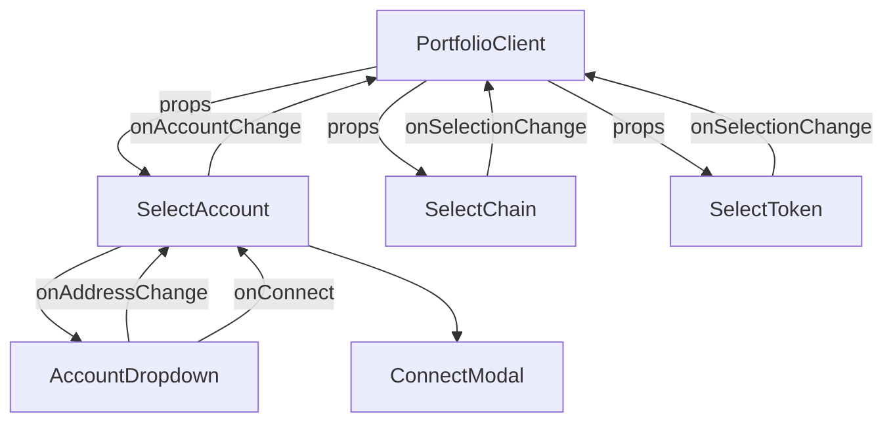

import { Callout, Tabs, FileTree, Cards } from 'nextra/components'

# Selection Components

The selection components form the configuration layer of the portfolio system, enabling users to specify which wallet addresses, blockchain networks, and token types they want to explore. These components work together to create an intuitive multi-step selection process that guides users through portfolio setup.

## File Structure

<FileTree>
  <FileTree.Folder name="app/portfolio" defaultOpen>
    <FileTree.File name="page.tsx" />
    <FileTree.File name="PortfolioClient.tsx" />
    <FileTree.File name="metadata.ts" />
    <FileTree.File name="page.module.css" />
    <FileTree.Folder name="components" defaultOpen>
      <FileTree.Folder name="selection" defaultOpen>
        <FileTree.File name="SelectAccount.tsx" />
        <FileTree.File name="AccountDropdown.tsx" />
        <FileTree.File name="SelectChain.tsx" />
        <FileTree.File name="SelectChain.module.css" />
        <FileTree.File name="SelectToken.tsx" />
        <FileTree.File name="SelectToken.module.css" />
        <FileTree.Folder name="__tests__">
          <FileTree.File name="SelectAccount.test.tsx" />
          <FileTree.File name="AccountDropdown.test.tsx" />
          <FileTree.File name="SelectChain.test.tsx" />
          <FileTree.File name="SelectToken.test.tsx" />
        </FileTree.Folder>
      </FileTree.Folder>
      <FileTree.Folder name="organize">
        <FileTree.File name="ChainWrapper.tsx" />
      </FileTree.Folder>
    </FileTree.Folder>
    <FileTree.Folder name="__tests__">
      <FileTree.File name="PortfolioClient.integration.test.tsx" />
      <FileTree.File name="Content.unit.test.tsx" />
      <FileTree.File name="page.integration.test.tsx" />
      <FileTree.File name="metadata.unit.test.ts" />
    </FileTree.Folder>
  </FileTree.Folder>
</FileTree>

## Component Overview

The selection layer consists of four primary components that handle different aspects of portfolio configuration:

<Cards>
  <Cards.Card title="SelectAccount" href="#select-account">
    Wallet connection and address selection with ENS support
  </Cards.Card>
  <Cards.Card title="SelectChain" href="#select-chain">
    Multi-chain selection with visual network identifiers
  </Cards.Card>
  <Cards.Card title="SelectToken" href="#select-token">
    Token type filtering for ERC-20, ERC-721, and ERC-1155
  </Cards.Card>
  <Cards.Card title="AccountDropdown" href="#account-dropdown">
    Address display and switching interface with ENS resolution
  </Cards.Card>
</Cards>

## Architecture

The selection components follow a unidirectional data flow pattern where each component reports its state changes upward to the parent PortfolioClient component:



This architecture ensures clean separation of concerns and predictable state management across the selection process.

## PortfolioClient Component

The PortfolioClient component serves as the main orchestrator for the portfolio interface, managing the state of all selection components and passing the configured data to the ChainWrapper for display.

### Component Structure

The PortfolioClient uses a two-part structure to enable testing and proper provider integration:

```typescript
export default function PortfolioClient() {
  const [selectedAccount, setSelectedAccount] = useState<string>('')
  const [selectedChains, setSelectedChains] = useState<number[]>([])
  const [selectedTokens, setSelectedTokens] = useState<TokenType[]>([])

  return (
    <ChainInfoProvider>
      <Content
        selectedAccount={selectedAccount}
        onAccountChange={setSelectedAccount}
        selectedChains={selectedChains}
        onChainsChange={setSelectedChains}
        selectedTokens={selectedTokens}
        onTokensChange={setSelectedTokens}
      />
    </ChainInfoProvider>
  )
}
```

### Content Component

The Content component is exported separately to facilitate unit testing of the mapping logic without provider dependencies. It transforms the selected chains and tokens into the ChainData format expected by ChainWrapper:

```typescript
const chainData: ChainData[] = selectedChains.map((id: number) => ({
  chainId: id,
  chainName: getChainDisplayName(id),
  tokens: selectedTokens,
}))
```

### Layout Organization

The component organizes the selection interface into three distinct sections:

1. **AccountContainer**: Houses the account selection component at the top
2. **SelectionContainer**: Groups chain and token selection side by side
3. **ChainContainer**: Displays the portfolio based on current selections

### State Management

The PortfolioClient maintains all selection state at the top level, enabling:
- Centralized state management for all child components
- Easy testing of state transformations
- Clear data flow from selection to display
- Potential for state persistence in future updates

## SelectAccount Component

The SelectAccount component serves as the primary entry point for wallet interaction, managing both connection state and address selection for multi-account wallets.

### Core Functionality

The component provides comprehensive wallet management features including wallet connection triggering, multiple address support for wallets with multiple accounts, automatic address synchronization when wallet state changes, and custom modal integration for wallet selection. It also handles graceful disconnection with state cleanup.

### Implementation Details

```typescript
interface SelectAccountProps {
  onAccountChange?: (address: string) => void
}
```

The component leverages wagmi's useAccount hook to access wallet state and maintains internal state for the selected address. It automatically synchronizes with wallet connection changes and notifies the parent component of address updates through the onAccountChange callback.

### Usage Example

```typescript
<SelectAccount 
  onAccountChange={(address) => {
    console.log('Selected address:', address)
    // Update portfolio view for new address
  }}
/>
```

### Visual States

The SelectAccount component displays different visual states based on the wallet connection status and user interaction:

<Tabs items={['Disconnected', 'Connected', 'Address Selection']}>
  <Tabs.Tab>
  
    
    When no wallet is connected, the component displays "Connect Wallet" as a call-to-action button. This state serves as the initial entry point for users to begin interacting with the portfolio system.
  </Tabs.Tab>
  <Tabs.Tab>

    
    Once connected and an address is selected, the component displays the active address or its ENS name if available. The dropdown remains closed, showing a clean, compact interface with the selected account information.
  </Tabs.Tab>
  <Tabs.Tab>
   
      
    When the dropdown is opened on a multi-account wallet, users can see all available addresses. Each address is displayed with proper formatting, and users can easily switch between accounts by selecting a different address from the list.
  </Tabs.Tab>
</Tabs>

### ENS Resolution

The component automatically resolves ENS names for connected addresses through the AccountDropdown subcomponent. ENS resolution occurs on mainnet regardless of the currently connected chain, ensuring consistent name display across all networks. The interface displays shortened addresses while ENS names are being resolved.

<Callout type="info">
  ENS names are resolved asynchronously through wagmi's useEnsName hook. The component displays shortened addresses (0x1234...5678) until resolution completes.
</Callout>

## AccountDropdown Component

The AccountDropdown serves as the visual interface for address selection and wallet connection, implementing a custom dropdown design that integrates seamlessly with the portfolio's aesthetic.

### Visual States

The dropdown adapts its appearance based on connection state. When disconnected, it shows "Connect Wallet" as a call-to-action. When connected, it displays the active address or ENS name. The component includes smooth transitions between states and a rotating chevron indicator for open/closed states.

### Address Display Logic

The component implements intelligent address display with ENS name priority, showing ENS names when available and falling back to shortened addresses in the format 0x1234...5678. ENS resolution happens asynchronously without explicit loading indicators:

```typescript
const { data: ensName } = useEnsName({
  address: addr,
  chainId: 1, // mainnet ENS
})

// Display logic
{ensName ?? shorten(addr)}
```

### Accessibility Features

The dropdown includes comprehensive accessibility support with keyboard navigation using Tab and Enter keys, proper ARIA attributes for screen readers, focus management for dropdown states, and click-outside detection for intuitive closing behavior.

## SelectChain Component

The SelectChain component provides a visual interface for selecting multiple blockchain networks simultaneously, leveraging the ChainInfoProvider for logo and name resolution.

  

### Multi-Selection Interface

The component renders a vertically stacked list of selectable blockchain networks, each displaying the chain logo from ChainInfoProvider, a checkbox indicator for selection state, and the human-friendly chain name. Users can toggle any combination of chains to view assets across different networks.

### Integration with Wagmi

```typescript
const { chains } = useConfig()
```

The component automatically discovers all configured chains from wagmi's configuration, ensuring it always reflects the current network support without manual updates.

### State Management

The component maintains an internal checked state for each chain and reports changes through the onSelectionChange callback. The state structure uses a Record type for efficient lookups:

```typescript
const [checkedMap, setCheckedMap] = useState<Record<number, boolean>>({})
```

Updates are communicated to the parent component immediately through a useEffect that fires on every state change.

### Visual Feedback

Each chain item provides immediate visual feedback via the checkmark icon that appears when selected. There are no hover animations or disabled states baked in; styling relies on the base colors defined in the shared CSS variables. Chain logos attempt to load immediately and fall back to a generic logo via `getFallbackLogoUrl` if loading fails.

<Callout type="info">
  Chain selection operates independently of wallet connection status. Parent components must implement their own logic if they need to disable chain selection when disconnected.
</Callout>

## SelectToken Component

The SelectToken component enables filtering portfolio assets by token standard, supporting the three primary ERC token types used on EVM chains.

  

### Token Type Support

The component provides selection for three token standards. ERC-20 covers standard fungible tokens like USDC and DAI. ERC-721 includes non-fungible tokens (NFTs) such as artwork and collectibles. ERC-1155 encompasses multi-tokens that can be either fungible or non-fungible.

### Simple Checkbox Interface

```typescript
export type TokenType = 'ERC-20' | 'ERC-721' | 'ERC-1155'

const OPTIONS: TokenType[] = ['ERC-20', 'ERC-721', 'ERC-1155']
```

The component uses a straightforward checkbox pattern that allows multiple simultaneous selections, maintains state internally, and reports changes immediately to the parent component through a synchronous useEffect.

### Usage Patterns

Common selection patterns include viewing only fungible tokens by selecting ERC-20, exploring NFT collections with ERC-721 and ERC-1155, or comprehensive portfolio view with all types selected. The component maintains its own state without external dependencies.

## Integration Patterns

The selection components work together to create a cohesive configuration experience. Understanding their integration is crucial for extending or modifying the portfolio system.

### State Flow Example

```typescript
function PortfolioClient() {
  const [selectedAccount, setSelectedAccount] = useState('')
  const [selectedChains, setSelectedChains] = useState<number[]>([])
  const [selectedTokens, setSelectedTokens] = useState<TokenType[]>([])

  // Selection handlers update parent state
  const handleAccountChange = (address: string) => {
    setSelectedAccount(address)
    // Could trigger data refresh here
  }

  const handleChainsChange = (chainIds: number[]) => {
    setSelectedChains(chainIds)
    // Update portfolio view for new chains
  }

  const handleTokensChange = (tokens: TokenType[]) => {
    setSelectedTokens(tokens)
    // Filter displayed assets
  }

  return (
    <>
      <SelectAccount onAccountChange={handleAccountChange} />
      <SelectChain onSelectionChange={handleChainsChange} />
      <SelectToken onSelectionChange={handleTokensChange} />
      {/* Portfolio display components */}
    </>
  )
}
```

### Coordination Requirements

Since the selection components operate independently, parent components must implement coordination logic when needed. For example, if chain selection should be disabled until wallet connection, the parent must track connection state and conditionally render or disable the SelectChain component. The components themselves do not enforce these relationships.

## Styling and Theming

All selection components use CSS modules for scoped styling, ensuring no global style conflicts. The current implementation focuses on a consistent color palette, custom checkbox styling, and basic spacing. Hover/disabled animations are not implemented in these components, so teams that need richer interactivity should extend the CSS modules directly.

### Responsive Design

Responsiveness relies on simple width constraints (`max-width: 90vw`) and stacked flex layouts, which keeps the controls usable on small screens without additional breakpoints. There are no dedicated tablet/desktop layouts or hover-specific treatments today, so any advanced responsive behavior must be layered on by downstream consumers.

## Testing Coverage

The selection components have smoke-test coverage that exercises their most critical behaviors.

### PortfolioClient Tests

The integration test confirms that PortfolioClient renders its children inside `ChainInfoProvider`, while the Content unit test focuses on the `selectedChains`/`selectedTokens` → `ChainData[]` mapping logic. These tests do not simulate user flows end to end.

### SelectAccount Tests

Tests verify the two primary wagmi states (connected vs disconnected), ensure the component clears state on disconnect, and confirm that pressing the connect button toggles the custom `ConnectModal`. They do not yet simulate choosing alternate addresses from `AccountDropdown`.

### AccountDropdown Tests

Coverage ensures ENS names override shortened addresses and that multiple addresses render distinct labels. Accessibility behavior (keyboard navigation, ARIA assertions, click-outside handling) is untested today.

### SelectChain Tests

Tests stub wagmi’s `useConfig` to return two chains and assert that clicking an item toggles selection while firing `onSelectionChange`. Logo fallbacks, keyboard toggling, and multi-selection sequences beyond a single chain are currently untested.

### SelectToken Tests

The test suite renders all three token options and validates that clicking toggles `ERC-20` while invoking the callback. Additional permutations (keyboard interaction or selecting multiple token types) are not covered.

<Callout type="info">
  All component tests use Testing Library for ergonomics, but they intentionally stay close to high-level behaviors; detailed accessibility or styling assertions would require additional suites.
</Callout>

## Error Handling

The selection components implement basic error handling for common scenarios.

### Wallet Connection

The SelectAccount component relies on wagmi's built-in connection handling. Connection errors are managed by the wagmi provider and the ConnectModal component. The selection components do not implement specific error UI for connection failures, timeouts, or user rejections.

### Missing Data Scenarios

Components handle edge cases such as chain logo loading errors with fallback images and empty wallet scenarios by showing the "Connect Wallet" prompt. ENS resolution failures are handled gracefully by displaying shortened addresses.

## Best Practices

When working with selection components, follow these guidelines for optimal results.

### Development Practices

Always provide callback functions even if not immediately used, as this ensures future extensibility. Test with multiple wallet providers to ensure compatibility. Handle edge cases like empty addresses gracefully. Use TypeScript for type safety across all components.

### User Experience Guidelines

Provide immediate visual feedback for all interactions to ensure users understand their actions. Enable keyboard navigation for accessibility. Maintain selection state appropriately based on your application's needs.

### Integration Guidelines

Keep selection logic in parent components to maintain separation of concerns. Use callbacks for all state changes to ensure predictable data flow. Implement any needed validation or coordination logic in parent components. Consider implementing selection persistence in localStorage for returning users if needed.

## Playground

Use the full Storybook UI to explore the selection flow in a single sandbox.

<div style={{ width: '100%', height: 820, margin: '2rem 0' }}>
  <iframe
    src="/storybook-static/index.html?path=/story/portfolio-integration--playground&nav=0"
    width="100%"
    height="100%"
    style={{ border: '1px solid rgba(255,255,255,0.1)', borderRadius: '10px' }}
    title="Portfolio/Integration - Playground"
    loading="lazy"
    tabIndex={-1}
  />
</div>
