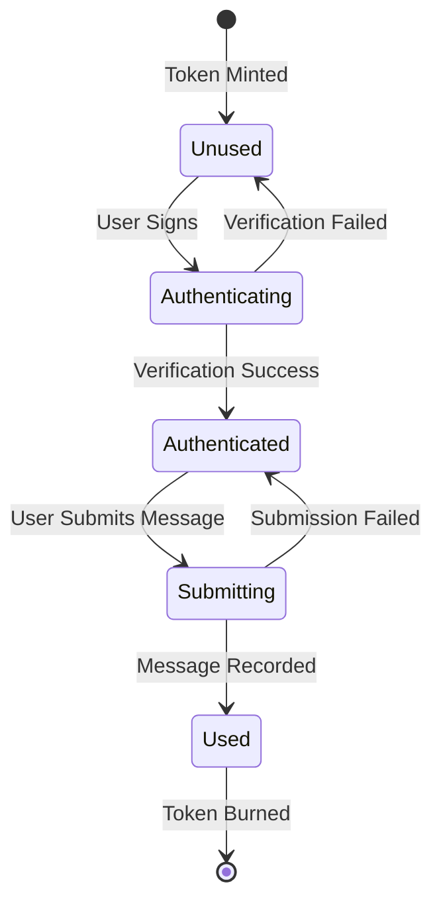

import { FileTree, Steps, Table, Tabs, Callout, Cards } from 'nextra/components'

# Token Gate

The RitoSwap Token Gate represents a sophisticated implementation of blockchain-based access control, combining on-chain NFT ownership verification with off-chain content delivery. This system creates an exclusive experience for Colored Key NFT holders, granting them one-time access to submit a message and enjoy crypto-themed music created by Rito Rhymes.

## System Overview

The token gate operates as a multi-layered authentication and content delivery system that seamlessly bridges Web3 ownership with Web2 content management. At its core, the system verifies NFT ownership through cryptographic signatures, tracks usage through a hybrid blockchain-database architecture, and delivers exclusive content through secure, time-limited access mechanisms.

### Core Architecture Components

The token gate system orchestrates several interconnected services:

<Cards>
  <Cards.Card title="Authentication Layer" href="#authentication-flows">
    Dual-mode authentication supporting both SIWE and legacy signature verification
  </Cards.Card>
  <Cards.Card title="Content Delivery" href="#content-delivery-architecture">
    Server-side protected content with R2 storage integration for audio streaming
  </Cards.Card>
  <Cards.Card title="Usage Tracking" href="#usage-tracking-system">
    Prisma-based multichain token state management
  </Cards.Card>
  <Cards.Card title="Notification System" href="#notification-pipeline">
    Flexible email delivery through Vercel or Cloudflare Workers
  </Cards.Card>
</Cards>

## User Journey

Understanding the token gate requires following the complete user journey from initial connection to final message submission. Each step involves specific technical components working in concert to create a seamless experience.

<Steps>
### Step 1: Initial State Assessment

When users navigate to `/gate`, the `GatePageWrapper` component initializes and determines their eligibility status. The system performs several checks:

- **Wallet Connection Status**: Verifies if the user has connected their wallet through the app’s wallet UI
- **NFT Ownership**: Queries the blockchain to check if the connected address owns a Colored Key NFT
- **Usage Status**: Consults the Prisma database to determine if the owned token has already been used

The `GateModal` component renders different states based on these checks, providing appropriate guidance for each scenario.

### Step 2: Authentication Request

For users with unused NFTs, the authentication flow begins when they click "Sign & Unlock". The system determines which authentication mode to use based on whether the Cloudflare state worker (Durable Object) is enabled. Before requesting a signature, the dapp resets the view chain to the active contract chain.

```typescript
if (isSiweEnabled()) {
  // SIWE flow with nonce generation
  const nonceResponse = await fetch('/api/nonce')
  const { nonce } = await nonceResponse.json()
  message = createSiweMessage({ address, nonce, statement })
} else {
  // Legacy flow with timestamp
  const timestamp = Date.now()
  message = `I own key #${tokenId}\nTimestamp: ${timestamp}`
}
```

### Step 3: Signature and Verification

The user's wallet prompts for a signature. On mobile devices with WalletConnect, the system automatically triggers deep-linking to open the wallet application:

```typescript
if (isMobileDevice() && connector?.id === 'walletConnect') {
  openWalletDeeplink()
}
```

During this phase, a ProcessingModal appears to guide users through the wallet interaction, providing clear instructions and recovery options if the transaction becomes stuck. Upon signing, the request is sent to `/api/gate-access` for verification.

### Step 4: Content Delivery

Successful authentication triggers server-side content assembly through the Gated Content Library. This includes welcome text and submission form HTML, signed URL for exclusive audio content from R2 storage, and custom CSS and JavaScript for the gated experience. Upon successful verification, the system also triggers a local notification through the browser notification system, confirming "Access granted to the token gate" to provide immediate feedback to the user.

### Step 5: Message Submission

Within the gated area, users can submit one message using their token. This triggers another signature request and calls `/api/form-submission-gate`, marking the token as used, optionally delegating notification delivery to the Cloudflare worker, and (when configured) scheduling a backdoor reset. The submission flow also resets the view chain to the active contract chain before signing. Upon successful submission, another browser notification confirms "Your message has been recorded and your key has been used."

### Step 6: Completion

After successful submission, the interface transitions to show a completion message, and the token's status is updated across all systems.
</Steps>

## UI Feedback Systems

The token gate implements sophisticated user interface feedback mechanisms that guide users through complex blockchain interactions while providing clear recovery paths when issues arise.

### Processing Modal

During transaction signing and verification phases, the ProcessingModal component provides essential visual feedback and interaction options. This modal serves multiple critical functions in the user experience. It displays clear instructions about opening wallet applications or extensions, offers a cancel button that allows users to reset the UI state if transactions become stuck, and on mobile devices, presents an "Open Wallet" button that triggers deep-linking to the connected wallet application.


The ProcessingModal appears automatically during both the initial gate unlock signature and the message submission signature, ensuring users always understand the current state of their interaction with the blockchain.

### Rate Limiting Feedback

When users exceed API rate limits, the system displays a dedicated modal through the `showRateLimitModal` function rather than generic error messages. This modal provides specific information about the rate limit including the maximum allowed requests, remaining requests in the current window, and exact time until the rate limit resets. This transparency helps users understand the system's protective measures while providing clear guidance on when they can retry their action.


### Mobile Wallet Deeplinking

The token gate includes specific optimizations for mobile users, particularly those using WalletConnect. When the system detects a mobile device during signature requests, it automatically triggers the wallet deep-linking flow to switch over to the user's mobile wallet app to complete required actions:

```typescript
if (isMobileDevice() && connector?.id === 'walletConnect') {
  openWalletDeeplink()
}
```

This seamless integration eliminates the confusion mobile users often experience when trying to locate and open their wallet application manually during transaction signing.

<Cards.Card
  className="key-nft-car"
  title="Learn More About the Custom Mobile Wallet Deeplinking"
  href="/dapp/wc-deeplinking"
  arrow
/>

### Tabbed Gated Experience

Once unlocked, the gated area renders three always-mounted tabs so users can move between features without losing state:

- **Msg Rito**: The one-time message form powered by the injected HTML/CSS/JS from the gated content package  
- **Secret Song**: The R2-backed audio player for the exclusive track  
- **RapBotRito**: The embedded chatbot experience (`ChatBot` component) that lets holders interact with the AI without re-authenticating

The `TabsContainer` keeps all three panels mounted, so audio playback and the chatbot session persist while users switch tabs.

## Authentication Flows

The token gate implements a tiered authentication system that prefers the lightweight, short-lived JWT minted after a successful unlock and only falls back to signature verification when necessary. Every request to `/api/gate-access` is evaluated in this order:

1. **Bearer JWT** – If the client attaches `Authorization: Bearer <token>`, the route verifies it with `@lib/jwt/server` and trusts the embedded `tokenId`. No additional signing round-trip is required.  
2. **SIWE** – When the Cloudflare state worker is enabled, the request must include a SIWE message plus nonce.  
3. **Legacy Envelope** – When SIWE is disabled (typically local dev), the request must include the timestamped legacy message.

The route mints a fresh JWT any time it performs SIWE or legacy verification successfully, so frontends can immediately reuse it for subsequent content polls without prompting the wallet again.

<Tabs items={['SIWE Authentication', 'Legacy Authentication']}>
  <Tabs.Tab>
    ### Sign-In with Ethereum (SIWE) Flow
    
    When the Cloudflare Durable Object state service is configured, the system uses the modern SIWE standard for authentication. This flow provides enhanced security through domain binding and nonce-based replay protection.
    
    #### Prerequisites
    - `NEXT_PUBLIC_ENABLE_STATE_WORKER=true`
    - `STATE_WORKER_URL` pointing at the `/state` route of the worker
    - `STATE_WORKER_API_KEY` shared secret
    
    #### Technical Flow
    
    ```mermaid
    sequenceDiagram
        participant User
        participant Frontend
        participant Nonce API
        participant StateWorker
        participant Gate API
        participant Blockchain
        
        User->>Frontend: Click "Sign & Unlock"
        Frontend->>Nonce API: GET /api/nonce
        Nonce API->>StateWorker: Generate & store nonce
        StateWorker-->>Nonce API: Nonce stored
        Nonce API-->>Frontend: Return nonce
        Frontend->>User: Request signature (SIWE message)
        User-->>Frontend: Sign message
        Frontend->>Gate API: POST /api/gate-access
        Gate API->>StateWorker: Verify nonce
        Gate API->>Blockchain: Verify ownership
        Gate API-->>Frontend: Return gated content
    ```
    
    #### Security Features
    - **Nonce Expiration**: 5-minute validity window prevents replay attacks
    - **Domain Verification**: Ensures signatures are bound to the correct domain
    - **One-time Use**: Nonces are consumed upon verification
    
    <Callout type="info">
    The SIWE implementation follows EIP-4361 standards, ensuring compatibility with all major wallets while providing enterprise-grade security.
    </Callout>
  </Tabs.Tab>
  <Tabs.Tab>
    ### Legacy Signature Flow
    
    When the state worker is disabled (typically in local development) the system falls back to a timestamp-based signature verification. This mode maintains security while reducing infrastructure dependencies.
    
    #### Technical Flow
    
    ```mermaid
    sequenceDiagram
        participant User
        participant Frontend
        participant Gate API
        participant Blockchain
        
        User->>Frontend: Click "Sign & Unlock"
        Frontend->>Frontend: Generate timestamp
        Frontend->>User: Request signature (legacy message)
        User-->>Frontend: Sign message
        Frontend->>Gate API: POST /api/gate-access
        Gate API->>Gate API: Verify timestamp (5-min window)
        Gate API->>Blockchain: Verify ownership
        Gate API-->>Frontend: Return gated content
    ```
    
    #### Message Format
    ```
    I own key #${tokenId}
    Domain: ${requestHost}
    Path: ${requestPath}
    Method: ${httpMethod}
    ChainId: ${activeChainId}
    Timestamp: ${timestamp}
    ```
    
    #### Security Measures
    - **Timestamp Validation**: 5-minute expiration window
    - **Message Simplicity**: Clear, user-friendly signing experience
    - **Blockchain Verification**: Always confirms current ownership
  </Tabs.Tab>
</Tabs>

## Content Delivery Architecture

The gated content system implements a server-side protection model where exclusive content never exists in client-side code until authentication is verified. This architecture ensures that content remains truly exclusive to authenticated token holders.

### Server-Side Content Assembly

The [Gated Content Library](/dapp/internal-libraries/gated-content-library) orchestrates the assembly of multiple content components:

<FileTree>
  <FileTree.Folder name="Gated Content Package" defaultOpen>
    <FileTree.File name="welcomeText" />
    <FileTree.File name="textSubmissionAreaHtml" />
    <FileTree.File name="audioData" />
    <FileTree.File name="styles" />
    <FileTree.File name="script" />
  </FileTree.Folder>
</FileTree>

Each component serves a specific purpose in creating the complete gated experience:

- **Welcome Text**: Contextualizes the exclusive area and explains the one-time message submission
- **Submission Form**: HTML structure for the message input and submission button
- **Audio Data**: Configuration for the exclusive music player, including R2 signed URLs
- **Styles**: Custom CSS creating the cyberpunk aesthetic
- **Script**: Client-side JavaScript handling form submission

### Audio Streaming with R2

The exclusive crypto-themed music leverages Cloudflare R2 for secure content delivery:

```typescript
// Server-side URL generation
const audioUrl = await generateSignedAudioUrl(3600) // 1-hour expiration

// Client receives time-limited URL
audioData: {
  audioSrc: "https://account.r2.cloudflarestorage.com/bucket/HitMeBitcoin.mp3?X-Amz-Signature=..."
}
```

The [R2 Storage Library](/dapp/internal-libraries/r2-library) handles:
- S3-compatible signed URL generation
- Configurable expiration times
- Graceful error handling for audio unavailability

### Content Injection Security

The `GatedContentRenderer` component safely injects server-provided content:

```typescript
useEffect(() => {
  // Inject styles once
  const styleEl = document.createElement("style")
  styleEl.textContent = content.styles
  document.head.appendChild(styleEl)
  
  // Expose submission handler
  window.handleGatedSubmission = onSubmit
  
  // Inject HTML content
  containerRef.current.innerHTML = content.textSubmissionAreaHtml
  
  // Execute script in controlled context
  const runner = new Function(content.script)
  runner()
}, [content, onSubmit])
```

<Callout type="warning">
While the content comes from trusted server sources, always validate and sanitize any dynamic content injection in production environments.
</Callout>

## Usage Tracking System

The token gate implements a sophisticated hybrid tracking system that combines blockchain immutability with database efficiency. This design enables gas-free usage tracking while maintaining the security guarantees of blockchain ownership.

### Database Architecture

The [Prisma database layer](/dapp/internal-libraries/prisma) maintains network-isolated tables for each supported blockchain:

<Table>
  <thead>
    <tr>
      <th>Network</th>
      <th>Table Name</th>
      <th>Purpose</th>
    </tr>
  </thead>
  <tbody>
    <tr>
      <td>Ethereum Mainnet</td>
      <td>`token_ethereum`</td>
      <td>Production token usage tracking</td>
    </tr>
    <tr>
      <td>Sepolia Testnet</td>
      <td>`token_sepolia`</td>
      <td>Testing environment tracking</td>
    </tr>
    <tr>
      <td>RitoNet (Local)</td>
      <td>`token_ritonet`</td>
      <td>Development environment tracking</td>
    </tr>
  </tbody>
</Table>

### State Synchronization

The system maintains consistency between on-chain and off-chain state through multiple touchpoints:

1. **Initial Check**: [Token Status API](/dapp/api/token-status) queries both database and blockchain
2. **Usage Recording**: [Form Submission API](/dapp/api/form-submission-gate) marks tokens as used
3. **Real-time Updates**: Frontend polling ensures UI reflects current state

### Usage Flow



## Notification System Integration

The token gate leverages RitoSwap's dual notification system to ensure users remain informed throughout their journey. The system combines ephemeral toast notifications for immediate in-app feedback with persistent browser notifications for critical events.

### Notification Triggers

The token gate fires specific notifications at key moments in the user journey. When users successfully unlock the gate, the system triggers `sendNotificationEvent('GATE_UNLOCKED')`, displaying "Access granted to the token gate" through both toast and browser notifications. After successful message submission, `sendNotificationEvent('MESSAGE_RECORDED')` confirms "Your message has been recorded and your key has been used."

These notifications work in concert with the visual feedback provided by the UI components, creating multiple layers of confirmation that eliminate any ambiguity about action outcomes. The notification system respects user preferences through environment configuration while maintaining toast notifications as essential UI feedback that remains always active.

### Browser Notification Management

Browser notifications extend the token gate's communication beyond the active browser context. The system requests notification permissions at natural interaction points, such as during initial wallet connection, ensuring users understand the value of notifications without feeling pressured. All notifications include the RitoSwap favicon for brand recognition and auto-dismiss after 5 seconds to prevent notification center clutter.

## Account Management

The token gate implements sophisticated account switching logic that maintains data consistency when users change wallet accounts while on the gate page.

### Account Switching Behavior

When the system detects an account change, it initiates a carefully orchestrated transition process. The current gated content is cleared and all UI states reset to prevent data leakage between accounts. The system then triggers a data refresh to fetch the new account's NFT ownership status and usage information. During this transition, a loading state prevents user interaction until the new account data is fully loaded.

This process ensures that users always see accurate information for their current account, preventing confusion that could arise from cached data belonging to a previous account. The transition includes a subtle animation that acknowledges the account change without disrupting the user experience.

### State Cleanup on Disconnect

When users disconnect their wallet entirely, the token gate performs comprehensive cleanup to ensure security and privacy. All gated content is immediately removed from the DOM, authentication states are reset to their initial values, and any pending transactions or signatures are cancelled. This thorough cleanup prevents any residual data from remaining accessible after disconnection.

## API Endpoints Integration

The token gate orchestrates multiple API endpoints to create its complete functionality. Each endpoint serves a specific purpose in the authentication and content delivery pipeline.

<Cards>
  <Cards.Card title="Nonce Generation" href="/dapp/api/nonce">
    `/api/nonce` - Generates cryptographic nonces for SIWE authentication
  </Cards.Card>
  <Cards.Card title="Gate Access" href="/dapp/api/gate-access">
    `/api/gate-access` - Verifies signatures and delivers gated content
  </Cards.Card>
  <Cards.Card title="Token Status" href="/dapp/api/token-status">
    `/api/token-status` - Provides real-time token existence and usage data
  </Cards.Card>
  <Cards.Card title="Form Submission" href="/dapp/api/form-submission-gate">
    `/api/form-submission-gate` - Records message submissions and sends notifications
  </Cards.Card>
</Cards>

### Endpoint Orchestration

The endpoints work together in a carefully choreographed sequence:

```typescript
// 1. Initial state check (automatic polling)
const statusResponse = await fetch(`/api/token-status/${tokenId}`)

// 2. Authentication flow (user-initiated)
const nonceResponse = await fetch('/api/nonce')
const gateResponse = await fetch('/api/gate-access', { method: 'POST' })

// 3. Message submission (within gated area)
const verifyResponse = await fetch('/api/form-submission-gate', { method: 'POST' })

// Note: The token status endpoint only supports GET requests
// Database updates happen server-side during form-submission processing
```

## Notification Pipeline

The token gate system implements a flexible notification architecture that adapts to different deployment scenarios and scale requirements.

<Tabs items={['Direct Serverless', 'Cloudflare Worker']}>
  <Tabs.Tab>
    ### Direct Serverless Delivery
    
    For simpler deployments, the Vercel serverless function can send emails directly through the Brevo API:
    
    ```mermaid
    graph LR
        A[Token Gate API] --> B[Verify Token Endpoint]
        B --> C[Brevo API]
        C --> D[Email Delivered]
    ```
    
    **Configuration**:
    ```bash
    USE_CLOUDFLARE_WORKER=false
    BREVO_API_KEY=your-api-key
    SENDER_EMAIL=noreply@ritoswap.com
    RECEIVER_EMAIL=admin@ritoswap.com
    ```
    
    **Advantages**:
    - Simpler infrastructure
    - Direct control over email formatting
    - Lower latency for small volumes
    
    **Considerations**:
    - Email sending affects API response time
    - Limited retry capabilities
    - Scaling constraints of serverless functions
  </Tabs.Tab>
  <Tabs.Tab>
    ### Cloudflare Worker Delegation
    
    For production deployments requiring scale, the system can delegate email delivery to a Cloudflare Worker:
    
    ```mermaid
    graph LR
        A[Token Gate API] --> B[Verify Token Endpoint]
        B --> C[Cloudflare Worker]
        C --> D[Queue Processing]
        D --> E[Brevo API]
        E --> F[Email Delivered]
    ```
    
    **Configuration**:
    ```bash
    USE_CLOUDFLARE_WORKER=true
    CLOUDFLARE_WORKER_URL=https://your-worker.workers.dev
    ```
    
    **Advantages**:
    - Asynchronous processing
    - Better retry mechanisms
    - Global edge distribution
    - Queue-based reliability
    
    **Implementation Benefits**:
    - API responses remain fast
    - Email failures don't affect user experience
    - Built-in retry logic for transient failures
  </Tabs.Tab>
</Tabs>

### Email Content Structure

Regardless of delivery method, notifications maintain consistent formatting:

```html
Subject: Gated Msg by 0x1234...5678

<div style="background: #0a0f1b; color: white; padding: 20px;">
  <h2>New Token Gate Submission</h2>
  <p><strong>Token ID:</strong> 42</p>
  <p><strong>Address:</strong> 0x1234567890123456789012345678901234567890</p>
  <p><strong>Timestamp:</strong> March 15, 2024 10:30 AM</p>
  <div style="background: #1a1f2b; padding: 15px; margin-top: 20px;">
    <p><strong>Message:</strong></p>
    <p>User's submitted message content here...</p>
  </div>
</div>
```

## Configuration and Deployment

The token gate system's modular architecture allows for flexible deployment configurations based on infrastructure availability and scale requirements.

### Environment Configuration

<Table>
  <thead>
    <tr>
      <th>Feature</th>
      <th>Environment Variables</th>
      <th>Required Services</th>
    </tr>
  </thead>
  <tbody>
    <tr>
      <td>SIWE Authentication</td>
      <td>`NEXT_PUBLIC_ENABLE_STATE_WORKER=true`<br/>`STATE_WORKER_URL`<br/>`STATE_WORKER_API_KEY`</td>
      <td>Cloudflare Durable Object</td>
    </tr>
    <tr>
      <td>Audio Streaming</td>
      <td>`R2_API_ACCOUNT_ID`<br/>`R2_API_ACCESS_KEY_ID`<br/>`R2_API_SECRET_ACCESS_KEY`<br/>`R2_API_BUCKET_NAME`</td>
      <td>Cloudflare R2</td>
    </tr>
    <tr>
      <td>Email Notifications</td>
      <td>`USE_CLOUDFLARE_WORKER`<br/>`BREVO_API_KEY` or `CLOUDFLARE_WORKER_URL`</td>
      <td>Brevo API / Cloudflare Worker</td>
    </tr>
    <tr>
      <td>Database</td>
      <td>`DATABASE_URL`</td>
      <td>PostgreSQL with Prisma Accelerate</td>
    </tr>
  </tbody>
</Table>

### Deployment Modes

The system supports several deployment configurations:

1. **Minimal Mode**: Legacy auth + Direct email + Basic database
2. **Standard Mode**: SIWE auth + Direct email + Accelerated database
3. **Enterprise Mode**: SIWE auth + Worker email + Accelerated database with edge caching

### Network Configuration

Configure the target network through environment variables:

```bash
# For Ethereum Mainnet (default)
# No additional configuration needed

# For Ethereum Mainnet
NEXT_PUBLIC_ACTIVE_CHAIN=ethereum

# For Sepolia Testnet
NEXT_PUBLIC_ACTIVE_CHAIN=sepolia

# For Local Development (RitoNet)
NEXT_PUBLIC_ACTIVE_CHAIN=ritonet
NEXT_PUBLIC_LOCAL_BLOCKCHAIN_RPC=http://localhost:8545
NEXT_PUBLIC_LOCAL_BLOCKCHAIN_WSS=ws://localhost:8545
NEXT_PUBLIC_LOCAL_CHAIN_ID=90999999
```

## Security Considerations

The token gate implements multiple layers of security to protect exclusive content and ensure fair access.

### Authentication Security

- **Signature Verification**: All wallet signatures verified using viem's secure implementation
- **Replay Protection**: Nonces (SIWE) or timestamps (legacy) prevent signature reuse
- **Domain Binding**: SIWE messages bound to specific domains
- **Rate Limiting**: All endpoints protected against abuse

### Content Protection

- **Server-Side Assembly**: Content never exists client-side before authentication
- **Signed URLs**: Audio URLs expire after 1 hour, preventing long-term sharing
- **Single Use Enforcement**: Database tracking ensures each token used only once
- **Network Isolation**: Separate database tables prevent cross-chain confusion

### Implementation Best Practices

<Callout type="info">
**Security Checklist for Deployment**

- ✅ Enable HTTPS for all production deployments
- ✅ Configure CORS appropriately for API endpoints
- ✅ Set secure headers (CSP, X-Frame-Options, etc.)
- ✅ Implement proper error handling without exposing internals
- ✅ Monitor rate limits and adjust based on usage patterns
- ✅ Regular security audits of signature verification logic
</Callout>

## Performance Optimization

The token gate system implements several optimizations to ensure responsive user experience:

### Frontend Optimizations

- **Smart Polling**: Token status checks pause when users leave the tab
- **State Caching**: NFT ownership cached to reduce blockchain queries
- **Lazy Loading**: Audio player components load only after authentication
- **Progressive Enhancement**: Core functionality works even if auxiliary services fail

### Backend Optimizations

- **Edge Caching**: Prisma Accelerate caches frequently accessed token records
- **Connection Pooling**: Database connections efficiently managed
- **Async Operations**: Email sending never blocks user-facing responses
- **Graceful Degradation**: Audio failures don't prevent message submission

### Monitoring and Metrics

Key metrics to track for optimal performance:

- Authentication success rate
- Average time to content delivery
- Audio streaming performance
- Email delivery success rate
- Database query performance

## Troubleshooting Guide

Common issues and their solutions:

### "SIWE not enabled" Error
**Cause**: Durable Object state service not configured  
**Solution**: Verify `NEXT_PUBLIC_ENABLE_STATE_WORKER=true`, `STATE_WORKER_URL`, and `STATE_WORKER_API_KEY`

### Audio Not Playing
**Cause**: R2 configuration or signed URL generation failure  
**Solution**: Check R2 credentials and bucket permissions

### Token Already Used
**Cause**: Database shows token previously used  
**Solution**: User must burn token and mint new one

### Email Not Sending
**Cause**: Incorrect email service configuration  
**Solution**: Verify Brevo API key or Cloudflare Worker URL

## Summary

The RitoSwap Token Gate exemplifies sophisticated Web3 access control, seamlessly blending blockchain ownership verification with traditional web services. Through its modular architecture supporting multiple authentication modes, flexible content delivery, and scalable notification systems, it provides a robust foundation for token-gated experiences.

The system's careful balance of security, performance, and user experience demonstrates how modern dApps can leverage blockchain technology while maintaining the polish expected of enterprise applications. Whether deployed in minimal configuration for testing or full enterprise mode for production, the token gate adapts to infrastructure requirements while maintaining its core security guarantees.

For developers integrating with the token gate, the comprehensive API documentation, clear component boundaries, and extensive configuration options provide the flexibility needed to create unique token-holder experiences while building on a battle-tested foundation.
