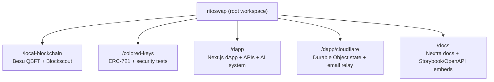

import { Callout, FileTree, Tabs, Cards } from 'nextra/components'
import versions from '@lib/versions';
import CryptoMusicSection from '@components/media/audio/CryptoMusicSection'
import ViewPage from '@components/utilities/viewpage/viewpage'

# Welcome to RitoSwap Docs

**Two Products in One: Multi-chain dApp + Musical AI Game**

RitoSwap pairs a Blade Runner‑inspired multichain dApp with a musical AI game experience powered by RapBotRito, an agentic, multi‑modal, chain‑aware voice‑clone extension of Rito Rhymes that you can rap‑battle against to earn rewards. It’s a full‑stack showcase spanning smart contracts, cross‑chain Web3 infrastructure, frontend UX, and a modern AI runtime with custom MCP tooling, on-chain interactions and text-to-speech voice-clone generation.
<ViewPage
  mainnetUrl="https://ritoswap.com"
  testnetUrl="https://testnet.ritoswap.com"
/>

Storybook UI playground: https://ui.ritoswap.com

Here is a faucet for free testnet Ether: https://cloud.google.com/application/web3/faucet/ethereum/sepolia

**GitHub Repository**: https://github.com/ritovision/ritoswap-mirror

## Core Features

**Multichain dApp**
- Custom ERC-721 smart contract for Colored Keys, only hold 1 NFT at a time per address with a randomized set of colors for an on-chain SVG image.
- On-chain NFT mint and burn for Colored Keys, burn-to-reset identity.
- Token gate with SIWE and JWT access tokens for fast re-entry.
- Cross-chain swaps via the LiFi widget.
- Multichain balance and portfolio view powered by Alchemy.
- Custom wallet UI on Wagmi and WalletConnect, with mobile deeplinking.
- Music-first experience with integrated players, original Rito Rhymes catalog, and PWA features across the experience.

**AI System - RapBotRito**
- An extension of the likeness of Rito Rhymes, an infotaining rapper in the crypto space with a voice clone used to generate spoken word audio.
- Token-gated AI experience embedded inside the gate.
- Mode-driven behavior for rap battle games with strict MCP tool allowlists.
- MCP server, LangChain orchestration, and Vercel AI SDK streaming.
- Chat JWT enforcement is env-toggleable; selected tools require JWT when enabled.
- Pinecone semantic database for lore, rhymes, and image search.
- Inline tools for GIFs, images, chain logos, and music playback.
- ElevenLabs voice clone for spoken-word raps, cached locally and routed through the Music Bar.
- Image generation streams base64 payloads directly to the client (no server storage).
- On-chain balance tools and (testnet only) limited crypto transfers.
- Token and crypto quota systems for controlled usage.
- Provider switching for OpenAI or LM Studio, plus multiple image providers.

**Quality and Observability**
- Playwright flows execute real Sepolia transactions for end-to-end validation.
- Supertest API suites cover the token gate and MCP surfaces, and contract tests lock the token gate schema.
- Sentry error boundaries and monitoring across client, server, and edge.

## Documentation Entry Points

Pick a path depending on what you want to explore first:

<Cards num={3}>
  <Cards.Card title="DApp" href="/dapp" arrow>
    Full-stack dApp pages, APIs, wallet UX, and token gate.
  </Cards.Card>
  <Cards.Card title="AI Systems" href="/ai-systems" arrow>
    RapBotRito architecture, MCP tools, modes, and chat UI.
  </Cards.Card>
  <Cards.Card title="Cloudflare Worker" href="/dapp/cloudflare" arrow>
    Durable Object state engine and email relay for the token gate.
  </Cards.Card>
</Cards>

<Cards num={3}>
  <Cards.Card title="Local Blockchain" href="/local-blockchain" arrow>
    Besu + Blockscout stack for local development.
  </Cards.Card>
  <Cards.Card title="Smart Contracts" href="/colored-keys" arrow>
    ERC-721 contracts, deployment, and security testing.
  </Cards.Card>
  <Cards.Card title="CI/CD" href="/ci-cd" arrow>
    Pipelines, environments, and quality gates.
  </Cards.Card>
</Cards>

## Docs Tooling

The docs site embeds live UI and API playgrounds:

<Cards num={2}>
  <Cards.Card title="Storybook Playgrounds" href="/docs-site/storybook" arrow>
    Embedded storybook builds from the dapp workspace.
  </Cards.Card>
  <Cards.Card title="OpenAPI Playground" href="/docs-site/openapi" arrow>
    Swagger UI with the Zod-generated OpenAPI spec.
  </Cards.Card>
</Cards>

## Technology Stack

This TypeScript-first codebase uses modern tooling across the stack.

### Frontend Technologies
The frontend is built with Next.js, Wagmi, Tanstack Query, Zustand, Framer Motion, and Howler. The dApp ships a custom wallet UI, portfolio viewer, and mobile deeplinking, while the docs run on Nextra.

### Backend and State
The backend uses PostgreSQL with Prisma and Prisma Accelerate, Cloudflare R2, Brevo SMTP, Vercel serverless functions, and a Cloudflare Worker plus Durable Object for nonces, rate limits, quotas, and email relay. SIWE and JWT access tokens secure the token gate and AI services.

### AI Backend
The AI system runs on the Vercel AI SDK with LangChain orchestration, an MCP server and tool registry, Pinecone semantic search, and provider switching between OpenAI and LM Studio. Tool access is JWT-gated and quota-controlled.

### Blockchain Components
Local development uses Hyperledger Besu QBFT with Blockscout. Production and testnet use Alchemy and public RPC endpoints. The ERC-721 contract is developed with Hardhat and validated with Slither, Mythril, and Echidna.

## Workspace Architecture

<FileTree>
  <FileTree.Folder name="ritoswap" defaultOpen>
    <FileTree.Folder name="local-blockchain">
      <FileTree.File name="docker-compose.yml" />
      <FileTree.File name="package.json" />
    </FileTree.Folder>
    <FileTree.Folder name="colored-keys">
      <FileTree.File name="hardhat.config.ts" />
      <FileTree.File name="contracts/" />
      <FileTree.File name="package.json" />
    </FileTree.Folder>
    <FileTree.Folder name="dapp">
      <FileTree.File name="next.config.cjs" />
      <FileTree.File name="app/" />
      <FileTree.Folder name="cloudflare">
        <FileTree.File name="wrangler.toml" />
        <FileTree.File name="package.json" />
      </FileTree.Folder>
      <FileTree.File name="package.json" />
    </FileTree.Folder>
    <FileTree.Folder name="docs">
      <FileTree.File name="next.config.mjs" />
      <FileTree.File name="content/" />
      <FileTree.File name="package.json" />
    </FileTree.Folder>
    <FileTree.File name="package.json" />
    <FileTree.File name="pnpm-workspace.yaml" />
    <FileTree.File name=".changeset/" />
  </FileTree.Folder>
</FileTree>

The monorepo contains five workspaces, including the root workspace that serves as the entry point for pnpm, changesets scripts, CI workflows, and shared configuration.

### Workspace Descriptions

**Local Blockchain and Block Explorer** (`/local-blockchain`): Single-validator Hyperledger Besu QBFT network with Blockscout for local development.

**Smart Contract and Security Tests** (`/colored-keys`): ERC-721 contract code plus deployment scripts and security testing.

**Decentralized Application** (`/dapp`): The main dApp, API routes, AI system, wallet UX, and token gate infrastructure.

**Cloudflare Worker and Durable State** (`/dapp/cloudflare`): Durable Object state engine for nonces, rate limits, and quotas, plus the email relay used by the token gate.

**Documentation** (`/docs`): Nextra documentation site with Storybook and OpenAPI playground embeds.

## Current Versions

The following table displays the current version of each workspace in the monorepo:

| Workspace | Version | Description |
|-----------|---------|-------------|
| Root | {versions.root} | Monorepo configuration and shared tooling |
| Local Blockchain | {versions['local-blockchain']} | Docker-based Hyperledger Besu QBFT environment |
| Colored Keys | {versions['colored-keys']} | ERC-721 smart contract implementation |
| DApp | {versions.dapp} | Full-stack decentralized application |
| Cloudflare Worker | {versions.cloudflare} | Durable Object state engine and email relay |
| Documentation | {versions.docs} | Nextra-based documentation site |

## System Requirements

To build and run this project locally, your development environment requires Node.js version 20.18.1 or higher (recommended minimum) and Docker Engine through Docker Desktop on macOS/Windows or Docker Engine on Linux with the latest stable release.

<Callout type="warning">
  **Critical: Use pnpm, not npm**

  This project is a monorepo with five workspaces built specifically for pnpm. Using npm will almost certainly lead to dependency conflicts due to its hoisting behavior. While Yarn might work, this repository is built, tested, and maintained exclusively with pnpm.
</Callout>

## Getting Started

Each workspace provides specific functionality that can be explored independently or integrated as part of the complete RitoSwap ecosystem. The documentation for each workspace includes detailed setup instructions, configuration guides, and implementation details.

## About the Project
<Tabs items={['Creator and Vision', 'Project Purpose', 'Music Integration', 'Design and Branding', 'Business Model']}>
  <Tabs.Tab>
    ### Creator and Vision

    RitoSwap is conceived and built end-to-end by Rito, also known by his music alias [Rito Rhymes](https://ritorhymes.com), with assistance from AI models including Claude and ChatGPT. The project serves as a comprehensive showcase of multi-disciplinary expertise across product development, brand management, UX design, and technology integration.

    

    Rito serves as a multi-hyphenate Chief Product Officer, UX & Design Leader, and Full-Stack Engineer through [RitoVision](https://ritovision.com), his hybrid studio and consultancy. This project demonstrates the harmonious integration of multiple roles that would often take a full team of specialists to execute including full-stack engineering, UX design, product strategy, brand management, music production, and creative direction.

    

    With a Master's in Human-Computer Interaction and over a decade of experience leading startups and building digital products, Rito brings deep expertise in connecting disciplines to solve complex business challenges. His work has garnered significant media attention, with features in The New York Times, ScreenRant, and U.Today, along with profile interviews on NYC's flagship 77 WABC radio and Stockhead magazine. His portfolio includes co-authoring blockchain standards with William Entriken, designing wearable technology showcased by celebrity fashion designers, leveraging global press coverage to drive patches in the multi-billion-dollar Call of Duty franchise, and spearheading end-to-end platform development for high-profile clients.
  </Tabs.Tab>

  <Tabs.Tab>
    ### Project Purpose

    This showcase demonstrates the core value proposition of a Chief Integration Officer who synthesizes and integrates domains across Product, Brand, UX, and Technology to derisk and amplify project value. While no single layer represents revolutionary innovation in isolation, how these many distinct layers work together showcases multi-disciplinary expertise and cross-functional execution typically requiring a full team.

    The project is built through AI co-piloting with manual oversight over each edit, not autonomous agents. Every architectural decision and implementation detail is managed directly, with full ownership of the process and responsibility for the construction of this comprehensive full-stack ecosystem.
  </Tabs.Tab>

  <Tabs.Tab>
    ### Music Integration

    The platform features original crypto-themed music produced by Rito with professional audio engineers. All lyrics are written by Rito, who performs vocals and oversees production of the final output. Additional vocalists contribute to choruses in songs like "Hodeler" and "Altcoin Love." None of the music is AI-generated. The RapBotRito voice clone extends the musical universe by turning assistant verses into spoken-word audio, powered by ElevenLabs in production.

    <Callout type="warning">
      Rito Rhymes is a registered trademark. The production voice clone and its outputs or derivatives are not open sourced. You are granted a personal, non-commercial license to consume the audio inside the app for personal entertainment purposes only. No commercial rights or redistribution are granted.
    </Callout>

    <CryptoMusicSection />

    Learn more about the music component:

    <Cards.Card title="Crypto Music Player" href="/dapp/music" arrow>
      Embedded music player component and audio management
    </Cards.Card>
  </Tabs.Tab>

  <Tabs.Tab>
    ### Design and Branding

    RitoSwap and this documentation site extend the RitoVision branding aesthetic. The design language draws inspiration from Blade Runner's cyberpunk aesthetic while maintaining creative professionalism with futuristic flair and holographic undertones. This visual identity permeates every aspect of the user experience, from the dApp interface to the documentation structure.
  </Tabs.Tab>

  <Tabs.Tab>
    ## Business Model

    RitoSwap operates as a pure showcase without monetization. The platform does not collect or sell user data, serve advertisements, charge fees beyond gas costs for NFT minting, or collect commissions from the LiFi swap widget integration. The project exists solely to demonstrate technical and creative capabilities.
  </Tabs.Tab>
</Tabs>

## License and Usage

The source code is licensed under the MIT License. However, trademarks including Rito Rhymes, RitoVision, and all associated branding, images, logos, voice clone assets, and music remain privately owned. The production voice clone and its outputs or derivatives are not open sourced. You are granted a personal, non-commercial license to consume the audio inside the app for personal entertainment purposes only. No commercial rights or redistribution are granted. Use of these brand assets is not granted under the open source license.

## Support and Resources

For technical questions and implementation details, consult the comprehensive documentation for each workspace. For questions about the project, its architecture, or potential collaboration opportunities with Rito including fractional services, visit https://ritovision.com.

## Explore the Documentation

Ready to dive deeper into the technical implementation? Start with the dApp and AI Systems sections to see how the core experiences are built end to end.
